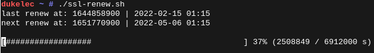

Most online tutorials for auto-renew rely on the cron job, which is usually set to auto-renew once a month.

Since each auto-renew requires a temporary shutdown of a web server like Apache, I would like to specify a longer auto-renew time, for example, every 80 days.

However, it is difficult to do this every 80 days with a cron job, because the `certbot renew` command is run once when the server is rebooted. If the certificate has not been in use for more than 30 days, it will not be renewed. If you continue to wait 80 days, you may exceed the 90-day maximum limit. And we generally do not want to force a certificate renewal every time the server restarts.

So I wrote a simple script that keeps track of the last time the certificate was renewed, and then only renews the certificate when the specified time is reached. The timer is not affected by reboots. And you can intuitively feel the time of the next renewal through the progress bar.

When using the script for the first time, the time of the last certificate renewal needs to be manually written to the log file. The exact time can be found from the relevant certificate file via `ls -l`.


Use the `screen -r` command to view the status and progress of the script:




Use the `screen` command to start the `ssl-renew.sh` script in the auto boot script:  
(The local service is part of the OpenRC of the Gentoo system. Other systems may have different auto-start methods.)

File `/etc/local.d/all.start`:

```
#!/bin/bash
screen -wipe
cd /root
screen -h 9999 -dmS "ssl-renew"; sleep 0.1
screen -S "ssl-renew" -p 0 -X stuff $"./ssl-renew.sh\n"
```

File `ssl-renew.sh`:

```
#!/bin/bash
#
# Software License Agreement (MIT License)
#
# Author: Duke Fong <d(at)d-l.io>
#
# Create ssl-renew.last template:
#   echo "$(date +'%Y-%m-%d %H:%M')" > ssl-renew.last
#
set -e

PROGRESS_BAR_WIDTH=50

draw_progress_bar() {
  # arguments: current value, max value, unit (optional)
  local __value=$1
  local __max=$2
  local __unit=${3:-""}

  if (( $__max < 1 )); then __max=1; fi
  local __percentage=$(( 100 - ($__max*100 - $__value*100) / $__max ))
  local __num_bar=$(( $__percentage * $PROGRESS_BAR_WIDTH / 100 ))

  printf "["
  for b in $(seq 1 $__num_bar); do printf "#"; done
  for s in $(seq 1 $(( $PROGRESS_BAR_WIDTH - $__num_bar ))); do printf " "; done
  printf "] $__percentage%% ($__value / $__max $__unit)\r"
}


renew=$((60*60*24*80)) # renew after 80 day

last=$(tail -n 1 ssl-renew.last)
last=$(date -d "$last" +%s)

next=$((last+renew))

echo "last renew at: $last | $(date --date @$last +'%Y-%m-%d %H:%M')"
echo "next renew at: $next | $(date --date @$next +'%Y-%m-%d %H:%M')"
printf "\n"

while true; do

    cur=$(date +%s)
    offset=$((cur-last))
    
    draw_progress_bar $offset $renew s
    
    if (( cur > next )); then
        printf "\n" # end progress bar

        last=$(date +%s)
        next=$((last+renew))

        echo "renew @ $last | $(date --date @$last +'%Y-%m-%d %H:%M') ..."
        echo "$(date --date @$last +'%Y-%m-%d %H:%M')" >> ssl-renew.last

        echo "stop apache..."
        /etc/init.d/apache2 stop

        echo "certbot renew..."
        certbot renew -n

        echo "start apache..."
        /etc/init.d/apache2 start
        sync
        echo "done, next renew at: $next | $(date --date @$next +'%Y-%m-%d %H:%M')"
        printf "\n"
    fi

    sleep 5
done

```

You can also restart other services in the script, for example, I need to restart the matrix server: synapse.


Incidentally, to create a new certificate using the `certbot` command, or to modify the domain name included in the certificate:
```
certbot certonly --standalone -d dukelec.com -d www.dukelec.com -d d-l.io -d www.d-l.io -d blog.dukelec.com -d blog.d-l.io -d e.d-l.io
```
Tip: If you modify the first domain name, a new certificate will be added.

