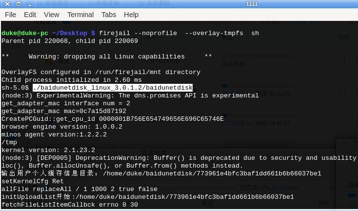
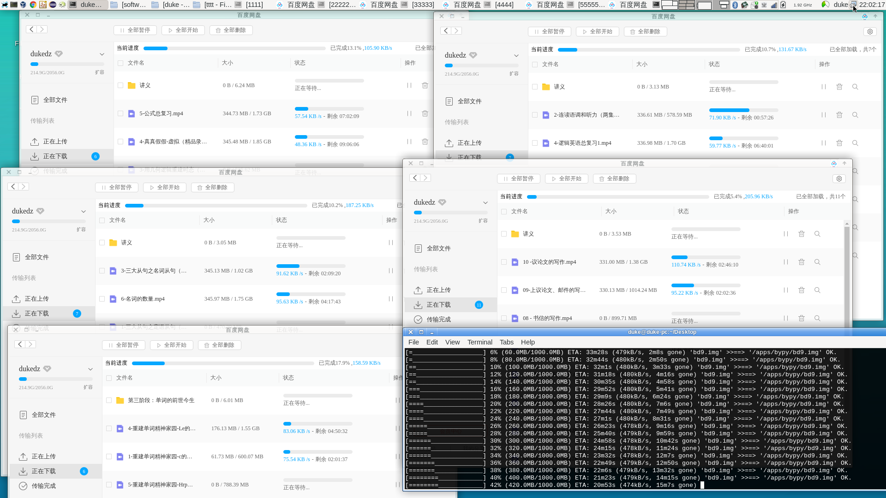

安裝沙箱軟件 `firejail` 和 百度網盤 官方 `Linux` 版本，通過沙箱啓動網盤。（我個人喜好是先啓動 `sh`, 再在 `sh` 中啓動網盤。）  

  

同樣的方法可以同時登錄多個窗口（同一個帳號，也可以不同）。  

沙箱跟 `--overlay-tmpfs` 參數後，寫當前分區不會保存，其它分區也沒法訪問，但可以訪問 `/tmp` 目錄，  
通過 `mount --bind /mnt/TT/tttt /tmp/tttt/` 命令把其它分區的目錄映射到 `/tmp` 目錄，  
下載的時候，網盤默認下載路徑選擇 `/tmp/tttt/` 就可以了。  

不同窗口下載不同內容，這樣整體下載的時間就縮短了。  

  

右下角的窗口和下載無關，是生成隨機文件，上傳網盤耗盡網盤免費空間的腳本工具，這麼做是因爲我討厭百度。  
腳本 `fxxk_bd.sh` 內容如下：（首次運行前先執行 `pip install bypy --user` 安裝第三方網盤工具，重新運行注意修改 CNT 初始值，避免重複。）


```
#!/bin/bash

CNT=0
while true; do
    echo "----------- $CNT -----------"
    dd if=/dev/urandom of=bd$CNT.img bs=10M count=100
    ~/.local/bin/bypy upload bd$CNT.img -v
    rm bd$CNT.img
    CNT=$((CNT+1))
    sleep 1
done
```
