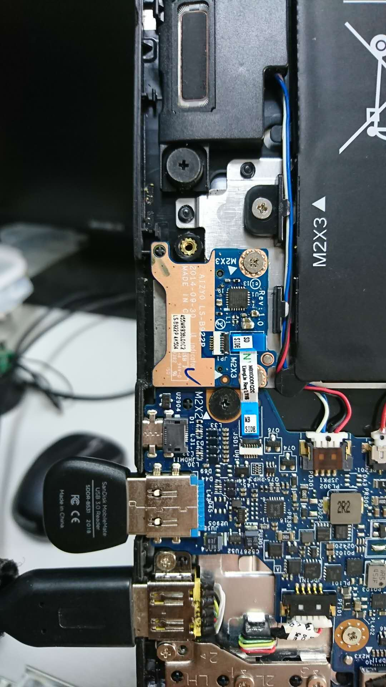
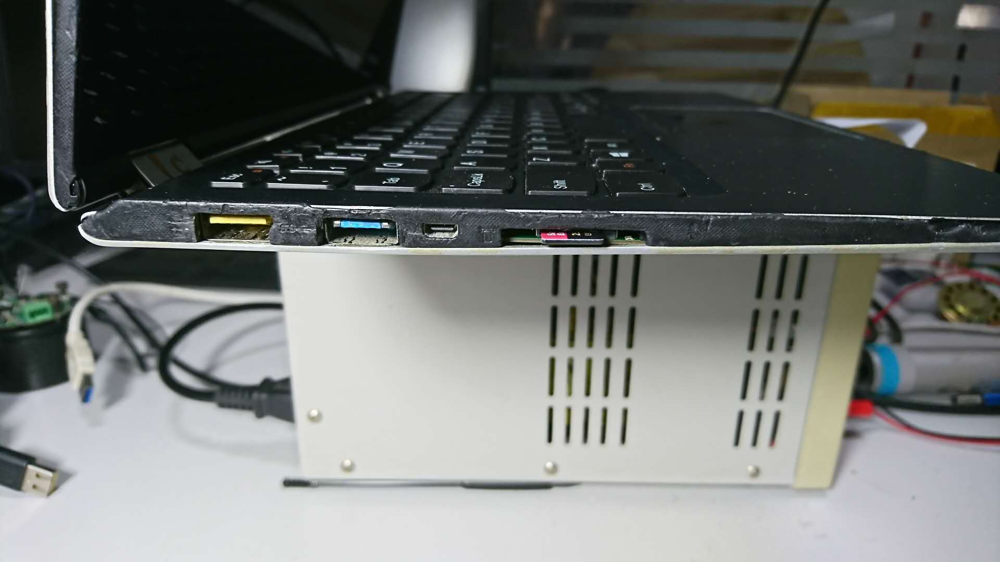

My laptop model is `Lenovo Yoga3 11 5Y71`, bought in 2015, it's small and light, but with few flaws,
e.g. the function keys F1 to F12 was not enabled by default (need press Fn key to use them),
there is an option in BIOS to bring them back (without press Fn key).
but, after change the option to use default F1-12 key, the Esc key became not default anymore,
so, I wrote a small patch for linux kernel to bring the Esc key back: [commit-fuck-lenovo.patch](commit-fuck-lenovo.patch)

My origin disk space is 256G, it's not enough for me, so I use TF card to expand them,
not use SD card because TF card does not stand out with this adapter:

Few days ago, my 64G TF card was full, so I bought a 256G SanDisk Extreme PRO card to replace it.

When I got the card, and insert it to my laptop, it does not work, dmesg show the error message:  
`mmc0: error -110 whilst initialising SD card`

lsusb say the card reader chip is RTS5129, after disassembling, I found that the actual model of the chip is RTS5170.
I upgraded the kernel to 5.0.9, and increased the capacitance for the chip, the fault remains.

  

Then I thought of a simple way for me to solve it: use another chip which use the common Mass Storage protocol instead.

Use the xfce translucent window feature to copy the board edges:

Finish soldering:

TF card popped and inserted:

If you need the PCB file (KiCad format), you can left a comment or email to me.

 
 This work is licensed under a <a rel="license" href="http://creativecommons.org/licenses/by/4.0/">Creative Commons Attribution 4.0 International License</a>.
