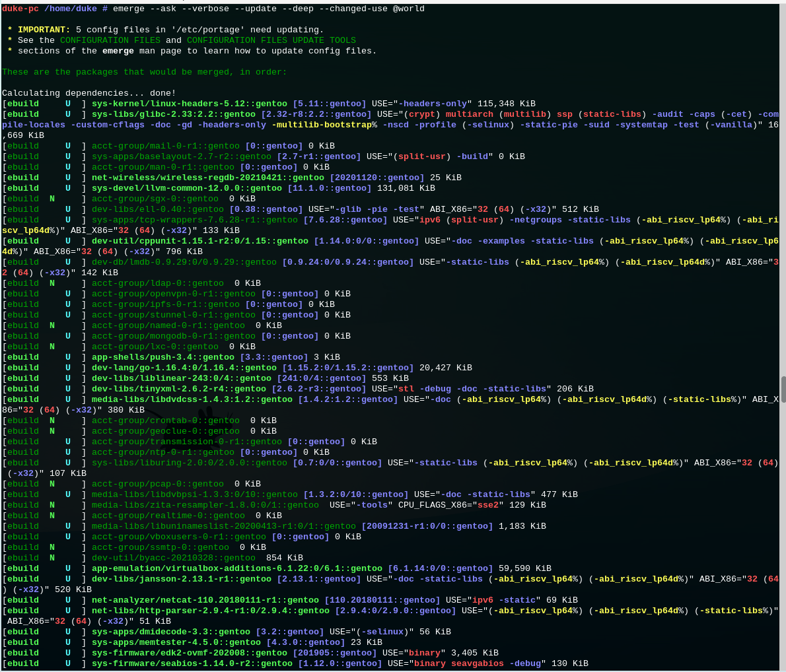
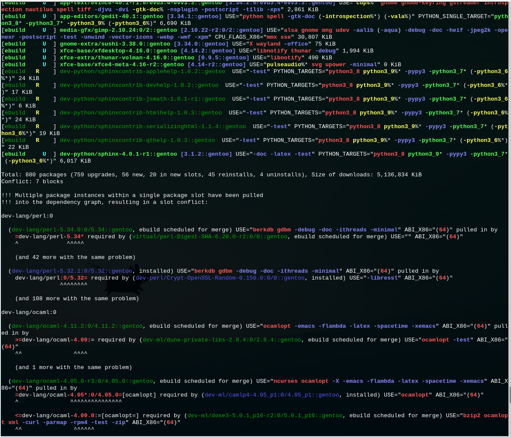
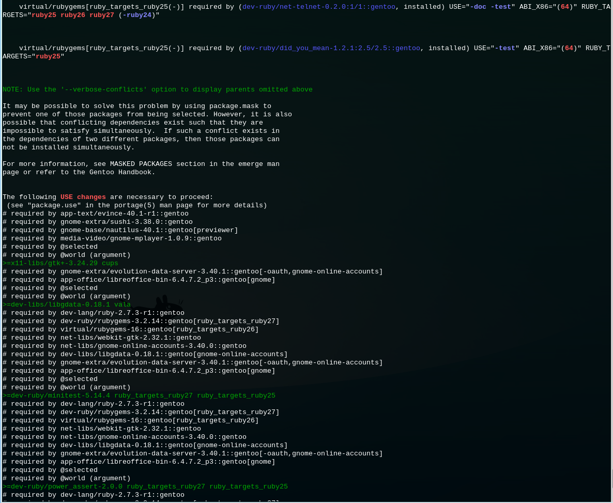
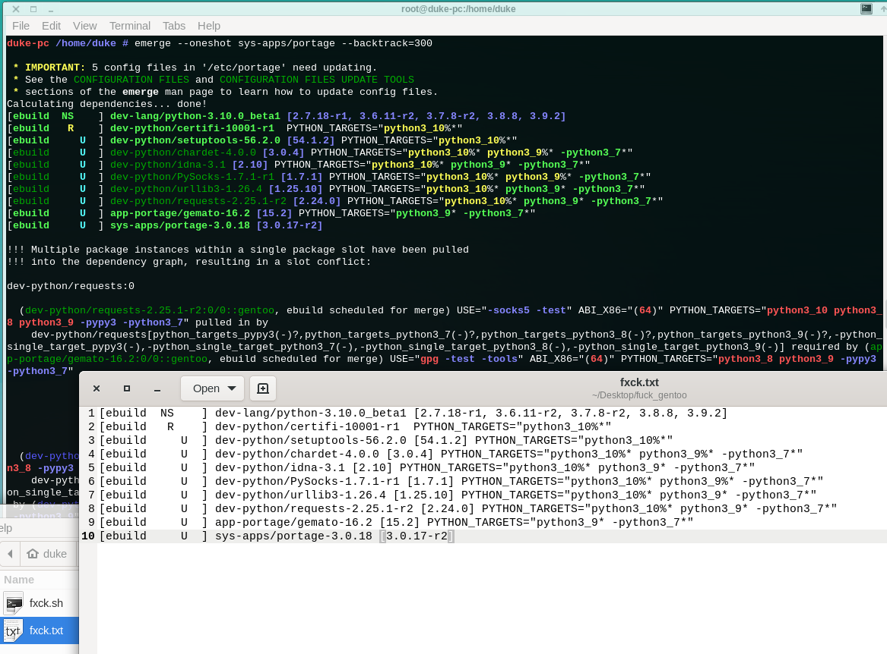

Gentoo has many advantages and is the ultimate choice for many Linux users.
However, Gentoo is a bit of a pain to upgrade,
especially if it has not been upgraded for a long time and there are many errors that can prevent you from entering the upgrade process.

For example, there are many errors when upgrading the world. The USE changes are recommended to be merged manually into package.use.
perl-related errors can usually be resolved with the perl-cleaner tool.
The remaining dependencies are usually still very difficult to resolve.








My solution is to copy the printed upgrade list into a file and use a script that forces the installation to go in order.
Once this is done, the system will be almost up to date.  
Additionally, try using the emerge upgrade world command again. Even if there are still errors, they will be easier to locate and fix.



The script has only one parameter: the path to the text list file.  
The script content:
```
#!/bin/bash
set -o pipefail
set -o errexit

input="$1"
while IFS= read -r line
do
    [ "$line" == "" ] && break
    [[ "$line" =~ ^'[ebuild' ]] || { echo -e "\n Skip: $line\n\n"; continue; }
    line="${line#*] }"
    pname="${line%% *}"
    pname="${pname%%:*}"
    ##pfile="${pname##*/}.ebuild"
    ##pname=$(echo "$pname" | sed 's/\(-[0-9]\).*//g')
    echo ""
    echo ""
    echo "$pname | $pfile"
    echo ""
    #continue
    emerge -v --nodeps --oneshot =$pname
    ##cd /usr/portage/$pname
    ##ebuild $pfile compile
    ##ebuild $pfile install
    ##ebuild $pfile qmerge
    ##rm -rf /var/tmp/portage/*
    echo ""
    sleep 1
done < "$input"
```

Sometimes upgrading the world only reports errors and does not print the upgrade list.  
You can try upgrading some software first. Any time that emerge has some errors and there is a printed upgrade list, you can use the script to upgrade.


### Updates:

I found that Gentoo upgrade problems can be solved by emerge with the `--nodeps` parameter, which can install programs that have dependency problems and are not allowed to be installed. In turn, we can break the dependency loop and solve various problems including world upgrades.

Sometimes I also like to use `emerge -C` to delete unimportant programs in order to solve problems.

Also, the above script has been modified to use the `--nodeps` parameter instead of ebuild compile, install, etc.


