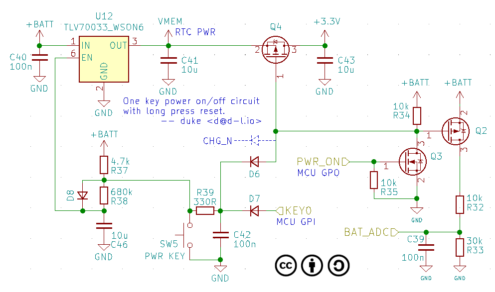
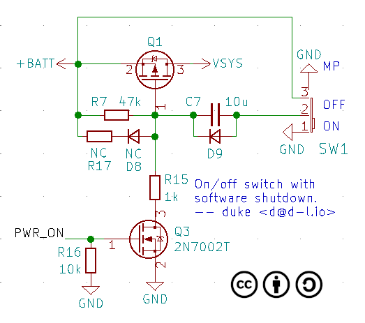

The first one is a one-button on/off switch, featuring a forced reset with a long press, no more fear of the software crashing.

The software function definition supports short presses and long presses, only extra long presses are used to reset (around 5 seconds).

For low power consumption mcu's that do not need to be switched off, Q4 D6 can be removed.

The second one is a pull-switch switch, featuring a software shutdown, so that you no longer have to forget to shut down the device and run out of battery (the software can automatically shut down after a timeout without operation).

 
 This work is licensed under a <a rel="license" href="http://creativecommons.org/licenses/by/4.0/">Creative Commons Attribution 4.0 International License</a>.
