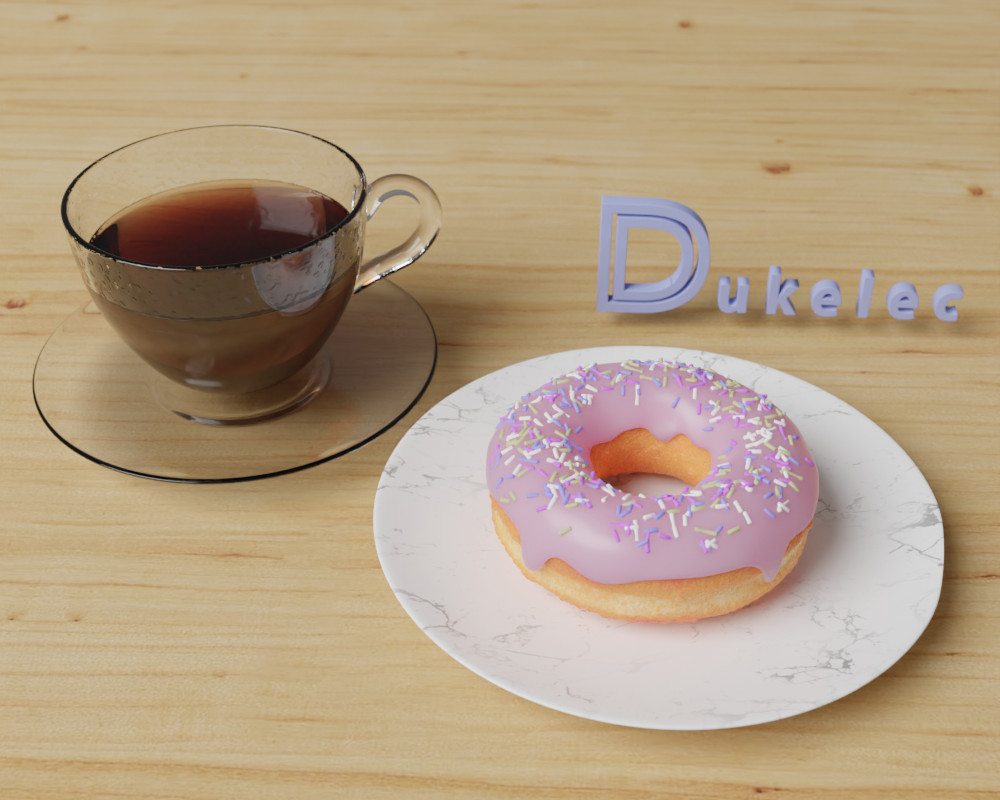

花了三天時間一邊學一邊畫的效果，原本是一個簡單的動畫，比較陽春就不放了，
幾年前學了一下 Blender 只是想着用來畫機械結構，沒有深入學習，
後來機械改用 Freecad 就更加生疏它了，日後會盡量多用 Blender 這個開源神器，
它還可以做各種仿真、可以設計服裝、做電影… 等等。

這次是跟着 Blender Guru 的 Youtube 視頻教程學的，推薦。

Blender 不太適合用來做機械設計，因爲不能輸出 step 之類的格式，但是可以用一些商業軟件，
譬如 Autodesk Fusion 360 的 Prismatic 轉換模式，可以把 mesh 類型文件智能地轉換成 step 格式，目前免費版本不支持（希望早日有開源替代）。  

如果是 3D 打印，直接用 stl 文件即可，不用轉換。

不過，機械設計爲主的場合，我還是需要繼續使用 Freecad.

