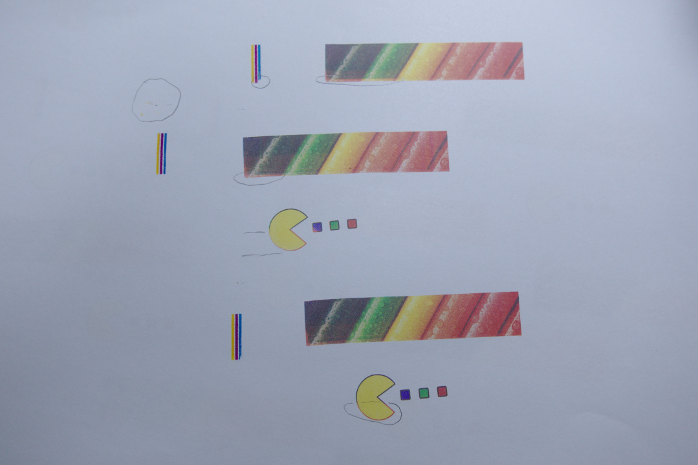
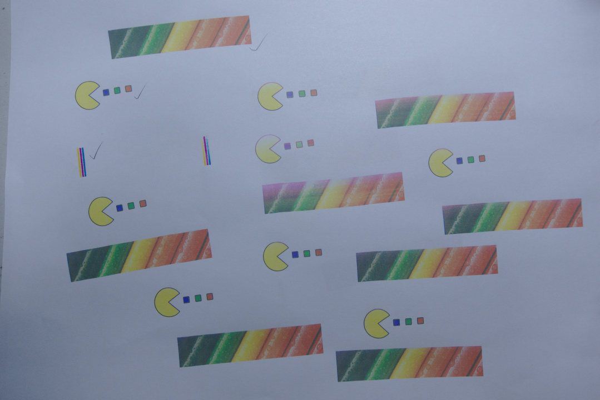
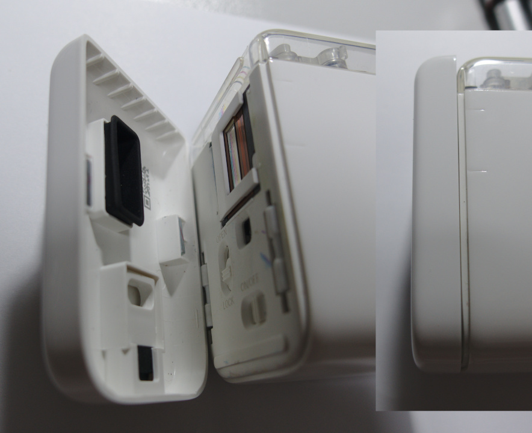
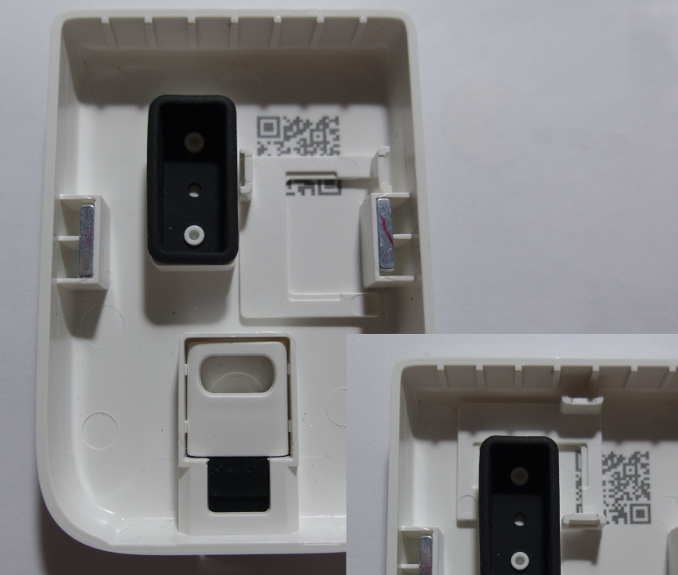
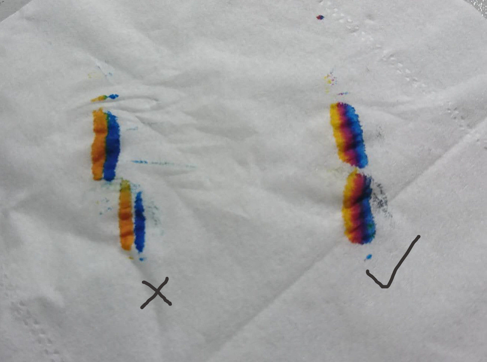
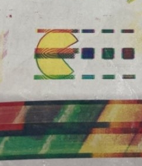
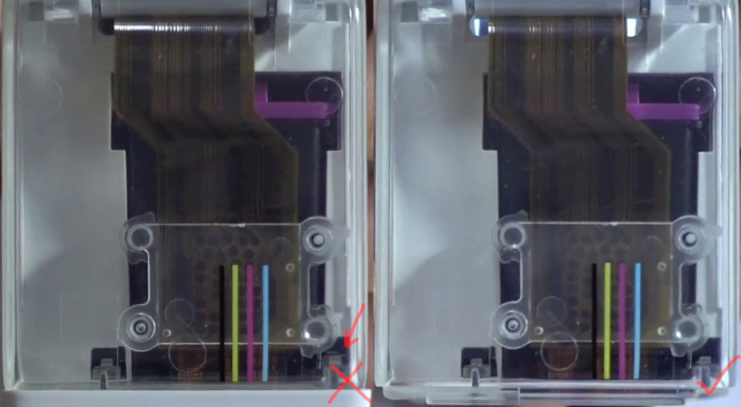
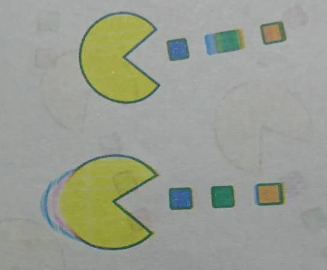

## None or incomplete printing
There are many reasons:

### Nozzles are dirty or dry
Dry cases:
Some or all of the printed colors are missing.

Solutions: breathe on nozzles, wipe them with tissue, long press for 1 second to clean.
The first two methods are recommended to operate before each printing, except for continuous printing.  
If there is a lot of ink on the nozzle and dirt such as hair is stuck, you need to wipe it with a tissue.  
(When breathing, it is best to cover the sensor with one finger to prevent the lens from fogging.)
<video width="100%" controls poster="video/dry1.png"><source src="video/dry1.mp4" type="video/mp4"></video>

If the above methods have limited effect, or the effective time is getting shorter and shorter, the recommended method is to soak water.  
Just after the operation, part of the color will be very light, you can recover by printing a few more times.
<video width="100%" controls poster="video/dry2.png"><source src="video/dry2.mp4" type="video/mp4"></video>
Before soaking:

After soaking:

You can even inject a small amount of pure water for each of the three colors with a syringe after tearing off the sticker from top of the cartridge.
(When finished, stick the sticker back to its original position, don't stick it crooked.)  
Original HP ink cartridges have high ink density and can easily block the print head. Soaking and adding water can alleviate this problem.

In the season, place or region where the ambient temperature is low and the air is dry, the nozzle is easier to dry,
breathe on nozzle can increase the temperature and humidity of the nozzle.
In addition, you can try to increase the driving intensity in the APP settings page and write it to the printer to take effect.

When the printer is not in use, close the base in time to reduce the time of evaporation of moisture in the air.
When closing the base, remove the Advanced Printing Holder, otherwise the base rubber cannot fit the ink cartridge nozzles tightly:  
  
You might consider placing it like this:  

### Out of ink
In this case, one of the three colors is usually missing.
The judgment method is to wipe the nozzle with a tissue in the front and back direction to see if the three ink colors on the tissue are equivalent.  

### Battery is too low
Please turn off the printer and charge for half an hour before trying again.

### Poor contact
Poor contact cases:
Bars appear in the printed picture, the picture is jagged, and one or more colors are missing at 1/2 or 1/4:  

1. Check if the transparent cover is closed:

<video width="100%" controls poster="video/conn1.png"><source src="video/conn1.mp4" type="video/mp4"></video>

  

2. Reinstall the ink cartridge.
3. Wipe the ink cartridge contacts with an eraser.
4. Have you ever used too much force and pulled out the cable when installing the ink cartridge?

<video width="100%" controls poster="video/conn2.png"><source src="video/conn2.mp4" type="video/mp4"></video>

If the above attempts are invalid, contact the after-sales service for repair.

### Cartridge expired
The laser print expiration date is on the back of the cartridge, and this date applies only to genuine HP cartridges.  
Judging by the experiment: wipe the nozzle with a tissue, one or more colors are very sticky, the ink is very little, and soaking water does not help much.  

### Print surface is too smooth
Cases: The moving distance is far greater than the printing length, the green light is not off, and no picture is printed or the picture is stretched.
(The picture may also be stretched because the printer moves too fast, and the buzzer beeps when it moves too fast.)  

The printer's position detection is based on a mouse photoelectric sensor, which is not sensitive to reflective or extremely delicate surfaces.
If you need to print on these surfaces, you can use the accessory black ruler.

In rare cases, the initialization of the photoelectric sensor is abnormal, and no object can be detected.
Restarting the printer can solve the problem.

## WiFi connection issues
WiFi connection is not available, or APP cannot be opened:

1. You can restart the printer and try again.

2. Battery is too low, please turn off the printer and charge for half an hour before trying again.

3. If the printer is connected to WiFi normally, but cannot open the APP:

  1. If you open the APP by scanning the QR code, please make sure whether the QR code scanning program can be used offline. The iOS system camera APP is fine. Android requires a third-party QR code scanning program that can be used offline. (The scan function built into IM software usually does not support offline use). You can also manually enter the address `192.168.44.1` in your browser.

  2. The Android system may automatically switch to use the mobile network when WiFi cannot access to the Internet. At this time, it cannot access the WiFi network of the printer that has been connected. You can turn off the function of automatically switching to the mobile network. One method for test is that after connecting to the printer WiFi, if you can still access common websites, it means that you have switched to the mobile network. You can temporarily shut down the mobile network to test the printer.

  3. Mobile browsers do not support the new HTML5 features. Usually the mobile phone has not updated the system browser for years, or an Android phone with a major change in the system (such as Android phones from mainland China). If the browser that comes with Android cannot open and use the APP normally, it is recommended to install the Firefox browser for testing. (Browsers confirmed to work: Firefox, Chrome, and Safari.)

4. The WiFi configuration has been modified and you don’t remember. You can press and hold the print key within five seconds after turning on the power until the white lights on both sides flash, and the WiFi default name and password will be restored.

5. If after trying the above operation, when the mobile phone connects to the printer WiFi, it keeps prompting that the password is wrong, or disconnect as soon as you try to connect. Basically, it can be judged that the problem is the frequency deviation of the WiFi hardware, and you can replace it with a new one. This issue is present on only a small number of machines shipped in 2019.

### Click "Print" pop up "Loading, please try later"
Because when using the APP by the default method, every time you open the APP, a 3M program will be downloaded from the printer. If the WiFi environment is congested, the download will be slow, so this prompt appears.  
If you often encounter this problem and do not want to wait, please refer to the "Software Offline Operation" chapter in the manual, install the APP to the desktop, and then click the desktop APP icon to start.

## Inaccurate colors
1. The ink cartridge has two color sequences. If the default settings do not match the current ink cartridge, it will cause the problem of red and yellow swapping. After changing the color sequence in the APP settings page, retransmit the pattern to the printer to take effect.

2. The ink cartridge nozzle chip has two widths. If the default setting does not match the current ink cartridge, it will cause the printed picture to be misaligned by 0.4mm, which is not obvious.

3. When the ink cartridge is not in use, you cannot simply paste the nozzle protective film back or put the ink cartridge back into the ink cartridge packaging. The siphon phenomenon will cause the three inks to be sucked out and mixed, forming a bridge, and eventually the color of the ink in cartridge will be mixed.

4. When the ink cartridge is dry and soaked in water, it should not be left on the desk for too long, otherwise it may cause color mixing.

### Color Calibration
On the settings page, adjust the sliders for 3 colors. Adjustment method: If the proportion of red currently printed is too high, keeps the red maximum and set the blue and yellow smaller. The same principle for other colors.  
The color difference is not recommended to be compared with the monitor, because some of the colors of the monitor cannot be expressed on paper. You can try an ordinary desktop color printer and print the same picture to the paper for comparison.

## Printing on non-absorbent surfaces
Printing on glass, metal, plastic surfaces, the sprayed ink will combine into small ink beads, and it will be wiped off.
The solution is to use liquid stationery glue, apply a thin layer with a sponge on the surface of the object, wait for it dry (you can speed it up with hot air), and then print on it.
If you want to be more waterproof and scratch resistant, you can spray a protective layer with varnish.

