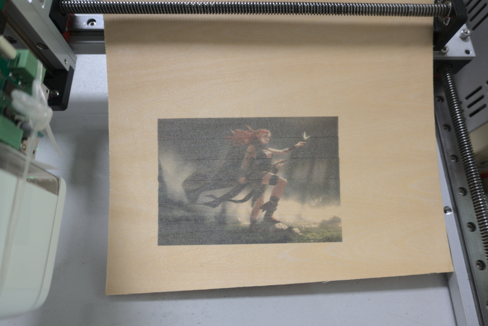

Palm-size and lightweight, enables color printing anywhere & anytime and on any surface by 3 steps.

  

    <video class="embed-responsive-item" controls poster="mb.jpg">
      <source src="mb.mp4" type="video/mp4">
    </video>
  

Indiegogo campaign: https://www.indiegogo.com/projects/princube-the-world-s-smallest-mobile-color-printer/

The documents and APP source code: http://github.com/dukelec/mb

New firmware release: https://github.com/dukelec/mb/releases

FAQ (important): <a href="../mb-faq">../mb-faq</a>

Multi-line printing demo:
https://youtu.be/r6bBqGQhlzU

### Updates

  PrinCube automation assembly tool (built on CDBUS).
  

    <video class="embed-responsive-item" controls poster="assembly-tool.jpg">
      <source src="assembly-tool.mp4" type="video/mp4">
    </video>
  

