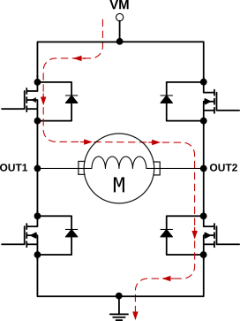

## 迷思

测试环境：电机带动一个小轮子，轮子不接触地面。

轮子最高转速由电机 KV 值决定，因为电机高速旋转会产生反向电动势，且和速度成正比，实际给电机注入的有效电压是电源电压减去反向电动势电压，
当转速升高到一定程度，有效电压也会降到一个临界值，此时产生的转动力刚好抵抗摩擦和风阻等阻力，从而达到一个平衡。

电机反向电动势小于电源电压，为何会倒灌到电源？

有刷电机相对简单，下面先拿有刷电机做分析，但让 PWM 驱动方式和 FOC 相同，驱动使能状态下，H 桥 0V 电压输出时，H 桥 MOS 以 50% 占空比同上同下不停开关。  
如果 H 桥 10% 的时间输出如下图的正向电压，则剩余 40% 时间两个上臂 MOS 短路电机，40% 时间两个下臂 MOS 短路电机。输出 10% 时间反向电压也是类似。（这里的短路目的是为了续流。）

H 桥输出最大正值，左上和右下 MOS 100% 时间导通，电机电流是由左至右，电机开始正转。  
等转到一定速度，是直接控制 H 桥输出 0V 电压（MOS 同上同下导通），还是输出最大负值（左下和右上 MOS 100% 时间导通），哪种会产生最大倒灌？  
如果直接关闭所有 MOS，又是否会倒灌？

宏观上来看，H 两个半桥，分别通过 PWM 输出一个电压，当 H 桥输出切换到 0V 电压时，旋转的电机产生的反向电动势一定大于 0V，此时电机便可以反向给 H 桥充电，形成倒灌。  
微观上，H 桥 MOS 以 50% 占空比同上同下不停开关，电机具体是如何倒灌的呢？是否是通过 MOS 体二极管形成通路呢？刹车时，电机速度降低，反向电动势为何会反而增加超过电源电压？（上面说了反向电动势和电机速度成正比，且小于电源电压。）  
如果 H 桥输出最大负值，宏观上电机电压可以倒灌吗？微观上又会发生什么？

微观上，一开始 H 桥输出最大正值时，图中电机看成一个电感，电流是从左到右，最后切换到 H 桥输出最大负值时，电感电流方向正好是给电源电压充电的方向，倒灌是否因此产生？

## 解答

其实，如果画出更合理的电机等效电路，以上问题就会变得很清楚：

一个有刷电机，对外可以等效成一个电感串一个电池，静止时，电池电压为 0V，H 桥给电感充入电流，电机开始旋转，电感中的电流会转换成电池电压（相当于电感损耗比较大，损耗用来充电），电压方向和 H 桥输出同向。

旋转到一定速度，此时 H 桥切换输出为 0V，MOS 以 50% 占空比同上同下不停开关，先看左边半桥，下面 MOS 导通时，左半桥输出被下拉短路到 GND，电机反向电动势没有半点可能通过上面 MOS 的体二极管，同理，上面 MOS 导通时，下面 MOS 的体二极管也不会有机会导通，所以我们可以忽略所有 MOS 的体二极管，倒灌和这些体二极管没有任何关系。

H 桥切换输出为 0V 时，电机内部等效的电池，会经过电感，被外部 MOS 短路，此时不会倒灌提升电源电压。  
H 桥切换输出为最大负值时，电机内部等效的电池，会经过电感，被外部电源短路，此时也不会倒灌提升电源电压，经过电感的电流会更大（两个电源叠加）。

宏观上，只有当 H 桥输出大于 0V，且输出值比电机内部等效的电池低的时候，才会发生倒灌，倒灌的微观动作如下，类似 DCDC 非隔离同步升压电源电路：  
微观上，H 桥输出同上同下短路阶段，电机内部等效的电池，给电感充电，H 桥输出正值时，等效的电池 + 电感，合起来的电压会超过电源电压，从而倒灌擡高电源电压。

至于无刷电机，无论是六步换相，还是 FOC 无级换相，其实只是换相方式不同，两相变成了三相，本质上和上面分析是一样的，可以套入上述结论。

最后说一下，对于电机主动刹车，不借助外力的情况下，理论上只有两个途径：
 1. 尽量通过 MOS 短路电机线圈，通过短路耗散能量，此方法比较危险，电流过大会烧掉 MOS 和线路，且过大的电流产生的电磁场可能会对永磁铁造成消磁。
 2. 让电机能量倒灌到电源，但电源太高也会烧毁 MOS 和芯片等元件，可以增加耗散电阻或者储能电容等电路，压制过高的电源电压。如果使用 TVS 强制限制电源电压，也要小心电流是否会过大，产生和第一条一样的问题。

### 补充

如果满速时，突然关闭所有 MOS，此时，电机等效电路中的电感的确会经过 MOS 体二极管倒灌到电源，
但此时电机电感线圈不再是 slow decay，而变成了 fast decay，所以电感的电流会很小，而且产生的电压还要减去 电机等效出来的电池电压，
而且此过程持续时间很短，主要的动能是储存在 电机等效的电池 中，不会作用于体二极管。  
所以大多数情况下，短时间的 fast decay 的电流，应该不会损坏 MOS 体二极管。
 
