1. [图形化编程](#图形化编程)
2. [视觉小场景](#视觉小场景)
3. [窗户自动开关装置](#窗户自动开关装置)
4. [机械臂现场绘画](#机械臂现场绘画)
5. [虚拟摄像头（微信小视频工具）](#虚拟摄像头)
6. [单车追踪器](#单车追踪器)
7. [加热器升级](#加热器升级)
8. [开关电源](#开关电源)
8. [LED 屏控制器](#led-屏控制器)
8. [LED 手写屏幕](#led-手写屏幕)

## 图形化编程

2017 春节前后，业余时间做的这个项目，因为之前了解到工业等行业领域一直很头痛的是软件操作复杂的问题，
所以一直在思考如何简化编程，最好可以模块化的快速搭建一个可用的程序，所以就做了这么个通过图形化连线、配置来构建场景程序的软件。

模块之间可以使用标准的 ROS 的 Topic 和 Service 来通讯，后来我嫌 ROS 的实时性很差、太过庞大和难用，所以又自己写了一个代替它的通讯库 CDIPC:
https://github.com/dukelec/cdipc

首先，一个模块可以由几个小模块组成，不同的模块负责不同的功能。
会有一个公共模块仓库，里面都是些通用的模块，可以直接拿来使用。
另外还可以增加一些流程图编程的模块，或是 Blockly 这些方便小白使用的编程模块，
而对于软件工程师来说，可以使用任何编程语言构建自己的模块。（传统开发方式一个项目用多种语言会很麻烦，大家被迫使用同一套语言和库。）

譬如下面这个简单的场景，是两个通用的模块，第一个模块是摄像头数据源，第二个是人脸探测模块，它可以直接输出探测到的座标数据，供其它模块使用。
模块运行的同时，界面也会实时更新画面显示，也方便调试。（传统编程对于多个视频窗口的调试比较麻烦，每次都要把多个窗口拖来拖去，让它们不相互遮挡。）

多一些模块的机械臂拖动示教的场景（这个分的太细，反而搞的太复杂，实际没有必要）：

## 视觉小场景

左手边的是玩 `Do not tap the white tile` 这个游戏，方块掉落到最下面的时候点击，点击一次发出一个音符，连贯起来是一首歌，越快分数越高，方块颜色不时会改变，有时颜色很浅，要兼顾的到。而且一局结束后要能自动开始下一局，这中间还经常弹出小广告要处理。这个场景是通宵一天一夜做出来的。

右手是和客人玩 `Tic Tac Toe` 下棋的游戏，包含视觉识别、下棋算法、图形化界面，整个软件是通宵一个晚上写出来的，第二天正常参与展会解说。

下面这个按颜色分拣乒乓球的场景是去上家公司之前，帮他们友情做的（15 年）：

## 窗户自动开关装置

17 年的作品，平时想开窗通风，又怕突然下雨，所以搞了这么个装置，市面上卖的装置安装很麻烦，要打螺丝，我这个用吸盘吸在玻璃上就可以了。

<video class="embed-responsive-item" controls poster="robotic-automatic-window/preview.png">
  <source src="robotic-automatic-window/video.mp4" type="video/mp4">
</video>

## 机械臂现场绘画

这是 16 年的作品。场景先是摄像头拍照，然后处理为机械臂轨迹，难点是如何把笔划顺序排列的更像人类绘画，因此，没有用现有的 Gcode 转换等工具，自己写算法提取线段及排列绘画顺序（这位是我同事兼朋友）。

演示还是用我喜欢的人来试好了，原图保密：

<video class="embed-responsive-item" controls poster="robotic-painter/preview.png">
  <source src="robotic-painter/video.mp4" type="video/mp4">
</video>

成品：

## 虚拟摄像头

15 年，微信发朋友圈小视频的时候，只能使用微信现场录制，很难抓拍的很好，所以想直接截取一段现有视频来发朋友圈，所以做了这么个东西。

它通过我自己写的软件，在后台自动播放指定的视频，然后微信或其它软件录制画面的时候，其音视频数据来源是我后台所播放的视频。

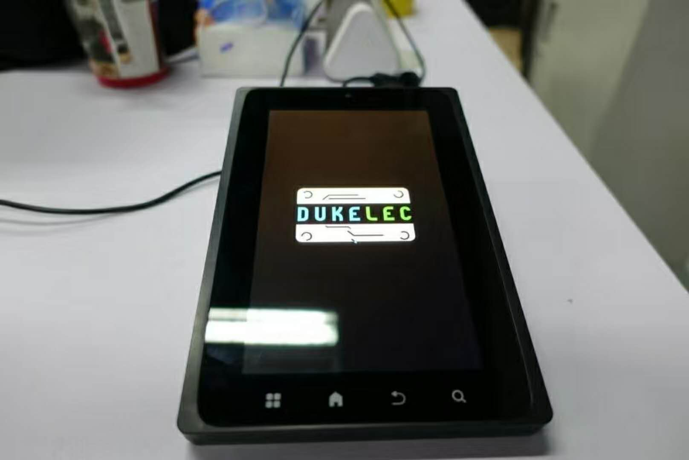

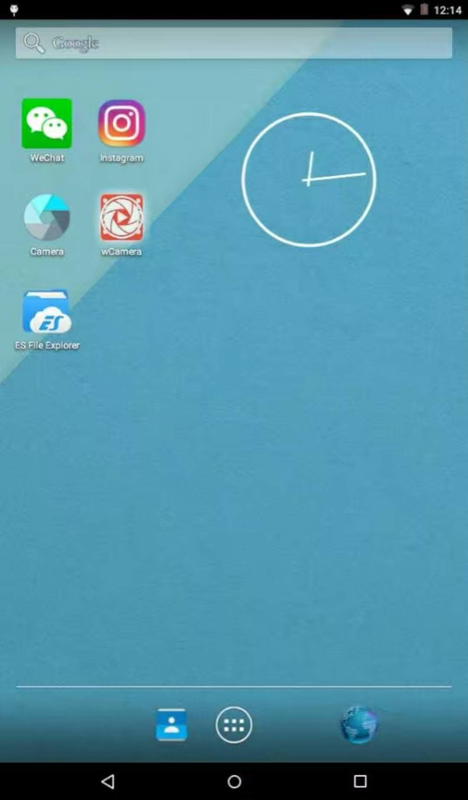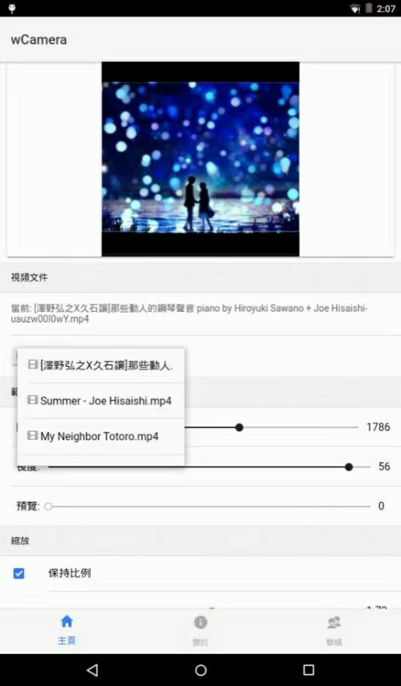
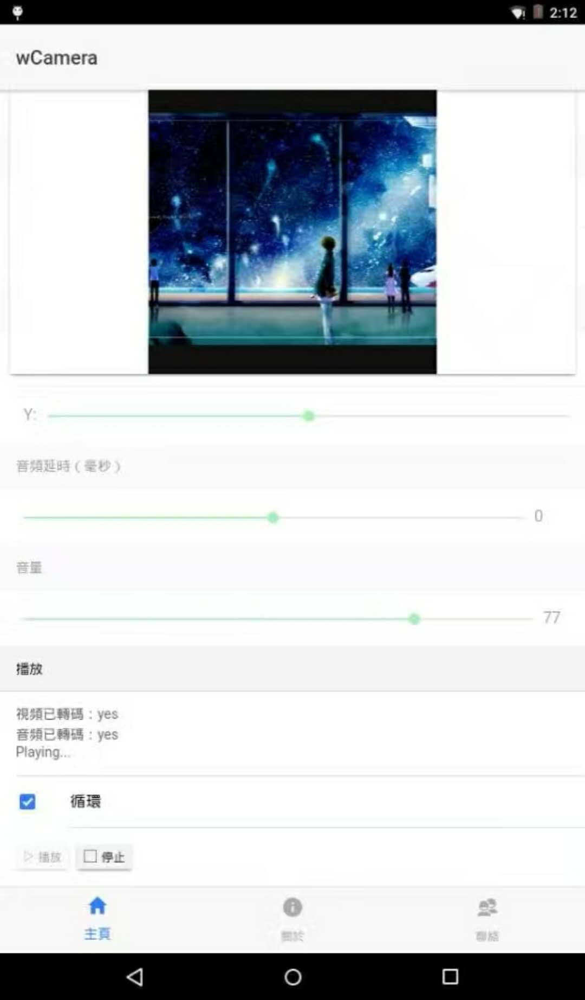

本来想者卖给做微商的客户，方便她们发布广告、或者以现场视角发布一些视频，满足业务需要，可是没想到刚做出来没多久，微信自身就支持视频文件截取发送了。😟

实际上，在这之前，还做了另外一个版本的工具，通过 HDMI 录制来实现：

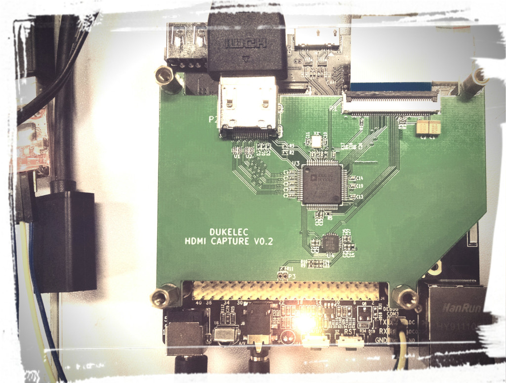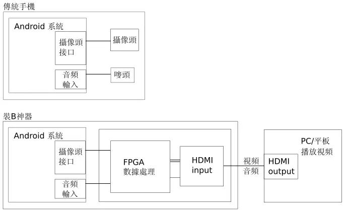

## 单车追踪器

之前丢过一次单车，后来买了个商用的 GPS 追踪器，伪装成车尾灯的样子（伪装的不好，偏大），然而有一次，车没丢，追踪器丢了，且追踪很不准确，一下在马路这边，一下在马路对面。
所以后来就自己 DIY 一个超小的可以放入车把手，这样就不会丢了，且自己写软件可以把定位算法优化的比较好。这个是 14 年做的。

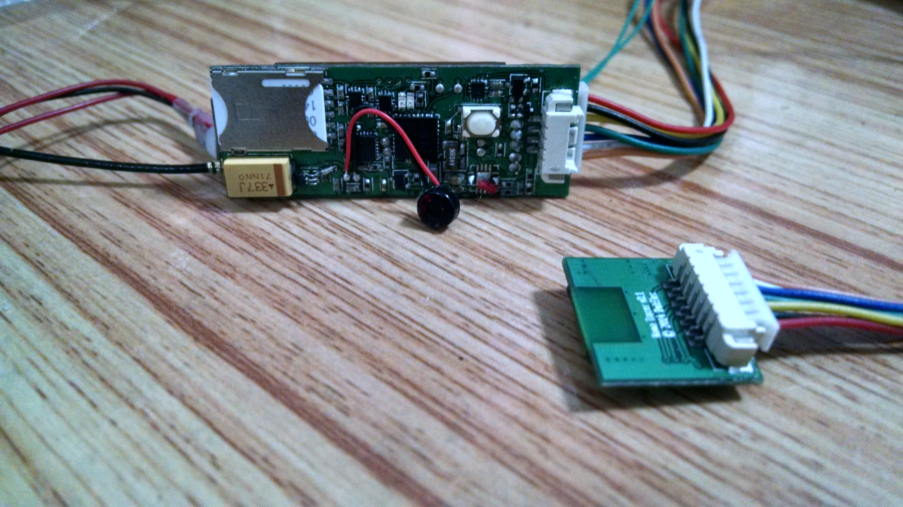

## 加热器升级

12、13 年帮朋友友情做的一个项目，把一个传统的加热器添加云端控制功能，我当时用的是 Google 的云服务 GAE,
硬件 Demo 直接拿现有的 3G 路由器产品改的，它没有足够的 IO, 就把两个 LED 灯的信号引到 MCU 以扩展 IO 口。

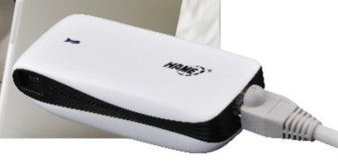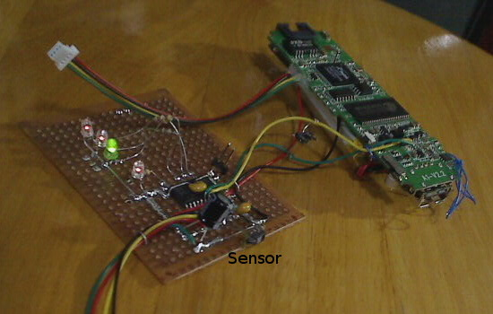

原有的控制板，割线以接管 LED 面板控制权：

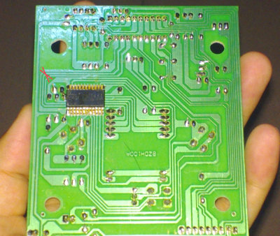

手机端界面：

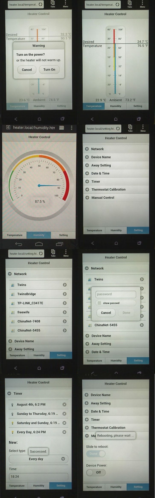

老博客相关文章：http://duke-blog.appspot.com/id/20131115151920193

## 开关电源

10 年的时候，当时变压器都是要自己计算参数、自己绕线圈、要手工磨中心的气隙，下图是一个 60W 带功率因素校正的电源：

## LED 屏控制器

同样是 10 年刚毕业在上海的时候，帮公司做的室外亮化工程用的多路灯管全彩控制器。
这些灯管顺着大厦的外墙窗户排列，远观就是跟屏幕一样，可以显示视频。

电脑端实时截屏和播放视频的软件：

本作品为一套通用型 LED 灯光控制系统，分为软件和硬件两部份，可依客户之不同 LED 灯具控制信号需求而定制，目前已经实现 TLS3001 芯片较为复杂的曼彻斯特编码，且支持灯具的不规则布线。
单台应用在小型 (8 端口 ×480 pixels) 或中型 (32 端口 ×1024 pixels) 的 LED 灯光系统控制，更大像素应用采用多台控制器即可。

系统通过以太网和 SD 卡实现同步、异步两种模式。主控板上: FPGA 处理集成 Gamma 校正的灰度位数扩展、RGB 排序、SRAM 芯片管理、DMA 控制和灯具时序生成等，处理器 STM32 实现 TCP/IP 协议层、人机接口以及整个主控板的管理。（TCP/IP 协议栈是自己写的，没有用别人的库。）

系统固件编写基于 GCC 工具链，FPGA 描述基于 Verilog 语言，上位机软件基于 GTK+ 图形库。

## LED 手写屏幕

这是大学生电子设计竞赛国赛的题目，要为普通的 LED 点阵屏增加手写功能。

主控将坐标编码等信息夹杂在待显信息中送至 LED 屏显示，光笔从中取得当前坐标信息后传回主控，主控再根据当前设定的模式进行相应的操作。
耗时的操作如屏幕扫描、坐标编解码及校验由 FPGA 逻辑实现；流程控制部分由软核 Nios ® II 来完成。

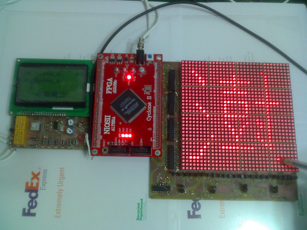

原理动画：

因为比赛是四天三夜，时间很紧张，学校条件非常有限，所有的软硬件都是我一个人负责，配的两个队友负责写文章和打下手，光是雕刻、焊一个板子都要花费很久时间，为了降低雕刻失败风险，用两个单面板背贴成一个双面板。
最后来不及做一个框选拖动之类的界面上的小功能，还好也拿到了国家二等奖。

最后贴一张学校寝室的照片，得到系主任特许，学校的东西喜欢什么都可以搬到寝室：

