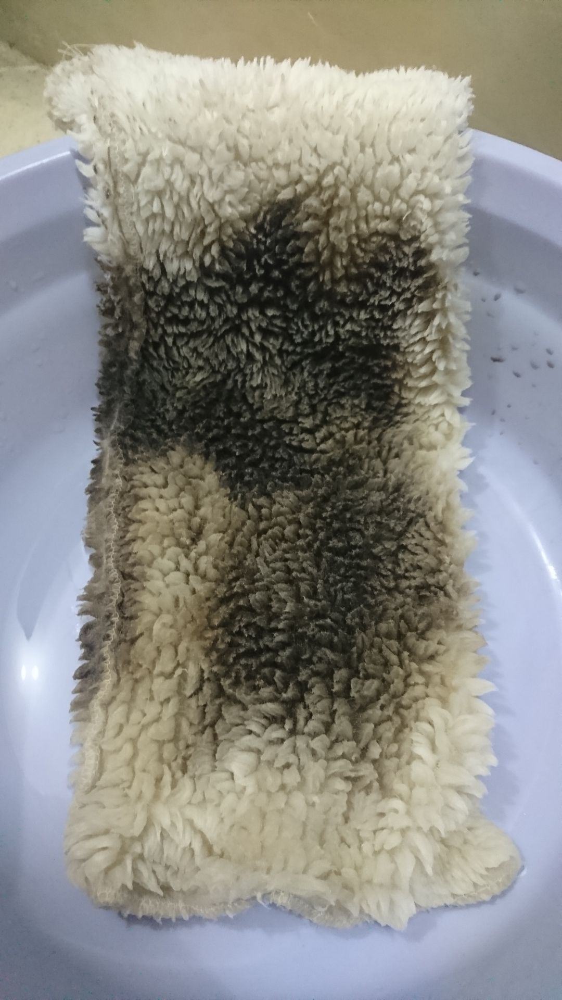
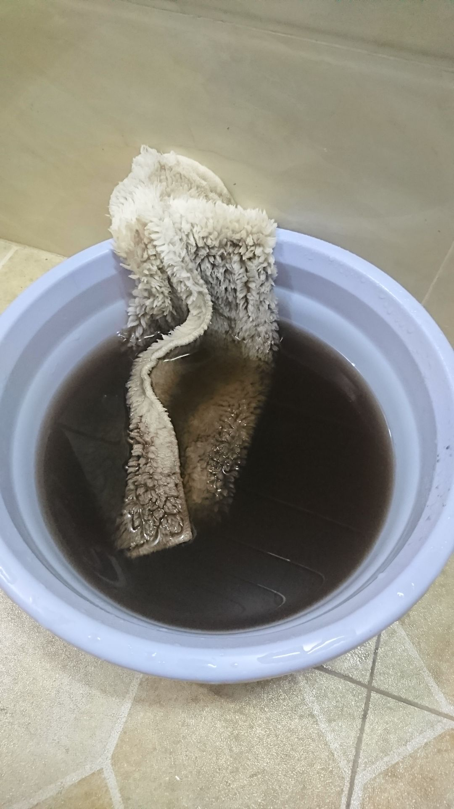
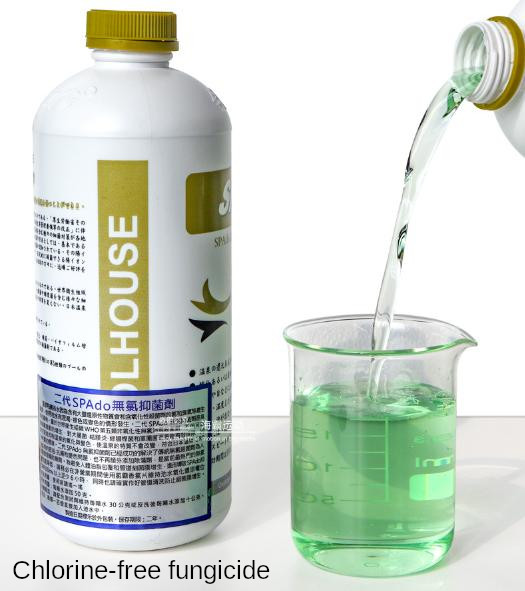
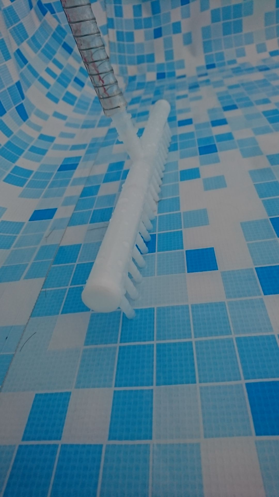
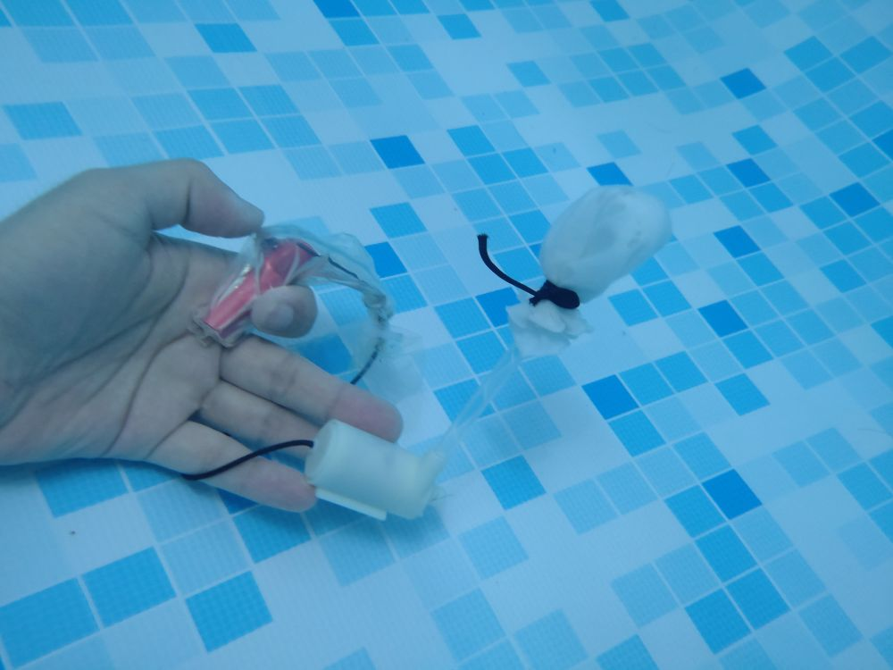

When I fill the pool, I need to tie a filter bag at the outlet of the water pipe, the filter bag in the picture is originally a fish tank product. Two filter bags can be used to further improve the filtering effect. When the water quality is not good, I need to pause a few times in the middle of filling the water to remove the filter bag for cleaning.

If I hadn't gotten this pool, I wouldn't have thought that the tap water in Guangdong, China could be such dirty:

After the water is filled, tie the cleaned filter bag to the water outlet of the circulating pump. Wash the filter bag every day for the first day or two. As the frequency of cleaning increases, the stain will become less and less, and then you can reduce the frequency of cleaning the filter bag.

When the pool is just filled with water, add a cap of "chlorine-free fungicide" (50ml), and then add a cap every one or two weeks. It is recommended to change the water once a month. Especially when the water quality is not good and the water looks yellow, this fungicide can make the yellow material quickly adsorbed by the filter bag, so that the water becomes clear. In addition, it can prevent the pool walls from growing slippery things (probably moss), while preventing odor (similar to the smell of umbrellas).

When changing the water for the pool, I use a normal hose to drain the water, one end is placed inside the pool and the other end is in the toilet, I use my mouth to suck a mouthful, then I can use the siphon principle to let the water in the pool slowly drain to a very low level.
Then use the diaphragm pump to continue to pump water, when the water level is very low, use the multi-port nozzle (originally a fish tank oxygen delivery splitter), you can pump the water at very low levels. When the water level is very low, you can also use a PVA mop to sweep the water towards the nozzle while you are pumping, so that the water can gather to increase the water level. Finally, when you can't pump water, you can use the PVA mop to clean the remaining water. The PVA mop is specifically used to clean the pool.

Occasionally there will be some dirty things inside the pool, such as dead flying insects, hair, mucous membranes, the slag not filtered out when filling the water, it is difficult to catch them by hand underwater, so I used a small pump to make an underwater cleaning tool, press the switch, the pump entrance aimed at the dirty things, we can easily suck them into the small filter bag (taken from used clothes). Waterproof bag is some kind of all-purpose balloon. Although the pool is equipped with a circulation pump and a large filter bag, but because the pumping inlet is relatively small, it is difficult to automatically capture these dirty things.

