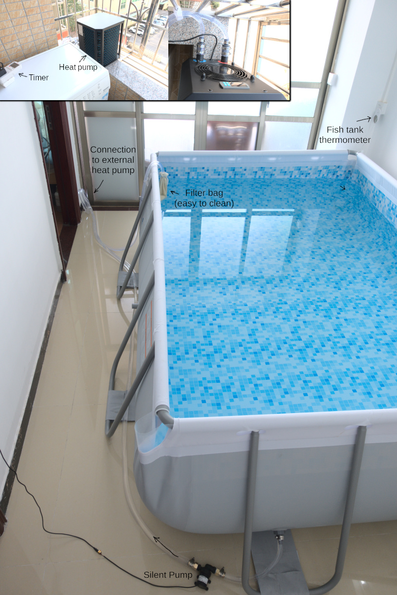

Swimming is the healthiest form of exercise, but it's inconvenient and unhygienic to go swimming in public places. But the good thing is that there are girls there.

However, the COVID-19 epidemic changed everything.

I was planning to buy a steel frame pool a few years ago, but it was too big to fit and I was worried about the building collapsing, and it was no fun if it was small.

I've seen this type of pool lately and it's not bad:

<video src="sub/target.mp4" controls></video>

But there would need to be a villa to fit in first, but my idea is to convert a very small steel frame pool into an infinity pool, the solution is to use an underwater motor in front of the pool and spray water backwards:

<video src="sub/motor.mp4" controls></video>

Then the AI algorithm analyzes the data captured by the camera to analyze the current user's joint posture (the effect of the algorithm test):

The final dynamic adjustment of the water spray intensity, so that people always remain in the middle of the pool.

Above all, I had the hardware and software almost ready and was about to file a patent application.

However, I suddenly thought of a very simple way to keep people in the middle of the pool by pulling on an elastic cord.

In order to ensure tension and positioning, the cord is divided into two sections, a very long section that cannot be stretched, and a small section with sufficient tension. (My tension rope is too weak to pull, so I use multiple cord together to increase the tension.)

The end result is as follows:

<video src="sub/final_sm.mp4" poster="sub/final_poster.jpg" controls></video>

There is a tendency for water to accumulate on the ground floor near the exit of the pool, so I also studied professional pools and used a strong fan to dry it:

For the pool, all the furniture from the living room was stuffed into the junk room.

To sum up, here are the benefits of my little steel frame infinity pool.
 - Clean.
 - Easy to use and ready to go.
 - Small footprint, low water consumption, easy to change water.
 - The sun shines on the inside of the pool at noon.
 - Can switch between indoor and outdoor, depending on whether the door is open or not.
 - You can turn on the air conditioner when it's hot, or turn on the electricity when it's cold.
 - You can listen to audio, which is more convenient than underwater headphones.
 - LED ambient lighting can be added.
 - You can swim naked.

Disadvantages:
 - Deep enough for breaststroke, barely enough for freestyle, next time I will buy a deeper one.

Size of pool I bought:

Finally, I'm going to give a name to this swimming method I invented: CD-SWIM.
