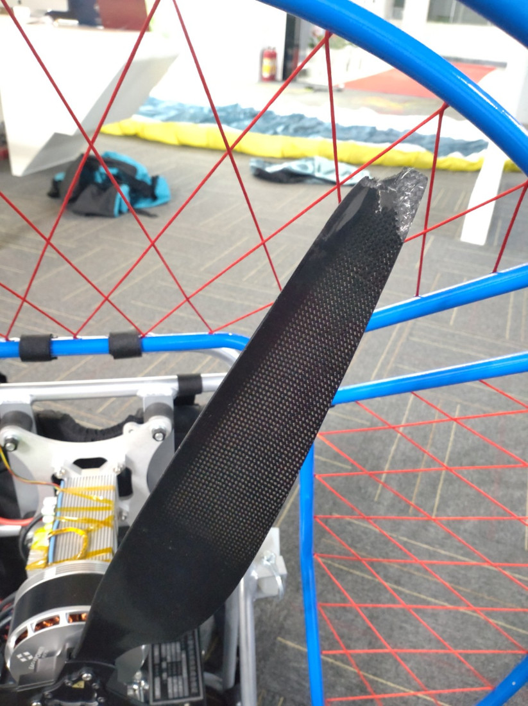

在學傘之前，我就一直想 DIY 固定翼小飛機，但是沒有條件開展，所以才想着先加入滑翔傘圈子，加入前的目標就是 DIY 電動動力傘。

前段時間想着先 DIY 一個飛行電腦熱熱身，硬件各功能寫代碼測試通過之後，一直沒時間寫軟件，飛行電腦功能是記錄飛行軌跡、測量滑降比，以及推算地面風速風向等，可爲動力傘設計提供參數，以及知道地面風速風向，降落更安全：  
（內含 CAM-M8Q GPS、ICP-10111 氣壓計、ICM-42688-P IMU、LIS2MDL 陀螺儀，主控 STM32G431CBU6，屏幕 192x96 4 色灰度，16 MBytes 存儲器）

後來想着要不先 DIY 一個地面牽引機，可以把人當作風箏一樣放飛，然後在天上主動斷開牽引繩，進入無動力滑翔模式  
研究了幾天，發現想做小做好也不容易，而且危險程度比動力傘還要大，所以放棄（有機會改請朋友用肉身在地面奔跑來幫我做牽引）

然後正式進入主題 —— DIY 電動動力傘，首先我不擅長結構，所以 TB 找了賣油動力傘的店家，買了油動力傘骨架，以及配套座袋  
買的是「DLE170 小框架」，定做加大了一點，因爲原本的油發動機配的是 32 吋（81.28cm）2 葉木槳，我嫌小，改成了「 UF3495-3 葉碳漿」34 吋（86.36cm）  
木槳螺距稍微大一些，是 12 inch；碳漿螺距只有 9.5 inch 的版本。而且 油發動機 轉速比較快，6000 rpm 以上，最大 9000 rpm  
希望尺寸 +2 inch 以及葉數 +1 能拉回差距

電機選的是「枭鹰动力EA120新款无刷电机农用植保多旋翼无人机电机推力35-40KG」KV75 版本，直徑 110.4 x 60.4mm，重 1.265Kg，滿電門最大電流有 120 A，5500 W，
推薦用 14S 的電池

結構方面，因爲油機尺寸比較大，我用電機，要用支柱把電機延長，以保證螺旋槳在合適的位置，而不是緊貼在我的後背（下面 3 張圖是賣家店鋪的）：

糾結怎麼延長糾結了很久，因爲實在是有點長，要加長 175mm，好在發現油機底座有單獨賣配件的，可以用的上，剩下 139mm 用 freecad 畫了一個結構，目前我集齊了以下：  
（另有 NOVA AONIC EN-A 整套裝備，非動力的，AONIC 傘頭可以配合動力傘使用）

編碼器磁鐵轉接的一個小鋁件也是我用 freecad 畫的（這兩個件各 1 pcs wenext 做了快一個月）  
大的延長支架本身是一個大散熱器，可以給電機散熱  
傳感器板上面還有一個 i2c 溫度傳感器，緊貼散熱器，檢測電機溫度  
編碼器芯片用的是 MA731 / MA732，它 SPI 協議設計的非常好，可以靠 PWM 內部觸發 SPI 通訊，然後 DMA 全自動搬運編碼器數據，抖動小，讀取速度快

做過很多小功率的 FOC 伺服控制板，這次改做一個大的（110x60mm），耐壓最大 100V，這個大小的固態電解電容貼片的商城只有 80V 的，所以先支持 80V 也足夠了，pcb 選的是 2oz 銅厚，背面還貼了導電鍍金銅條  
主控同樣是 STM32G431CBU6，MOS 驅動由 60V 低壓版的 DRV8323RS 換成 DRV8353RS（管腳不兼容很煩）

三個直流電源疊起來，空載接近 5000 rpm，示波器顯示電壓 80V

帶載才 1000 rpm 出頭，電源功率不夠，接下來要定做電池了

燒了好幾片 drv8353rs，由於電機急停沒處理好，導致電源電壓急升，然後芯片就不正常了，芯片使能後發熱嚴重，其它功能卻沒問題

<video class="embed-responsive-item" controls style="max-width: 100%">
  <source src="video/with_airscrew2.mp4" type="video/mp4">
</video>

## 2021.10.4 更新

電池回來了幾周了（花了 4388 RMB），定製的時候指定了壇友推薦的主動均衡的 BMS: JK-B1A20S15P，默認有 APP 通過藍牙 BLE 通訊查看電池狀態，還可以外擴 485 通訊  
（電池商家默認用的 BMS 也有藍牙，但是只能使用微信小程序，路走窄了）

要求可以達到 120A 持續工作，商家說沒做過 10 並 120A 的，會儘量按照我的需求來設計，實際能不能達到還有待我測試，擔心溫度會過高

電池實測 13.8kg（電芯淨重應該是 10kg），松下 21700 圓柱電芯，單節 18Wh，14串 10並，外面單獨配了一個 125A 的直流斷路器  
（電池以外，框架、電機、漿、電機支架、座袋、控制器 全套加起來目前是 9kg）

之前用可調直流電源測試的時候，1200 rpm 或更高的時候電機抖動很大，換上電池後，1500 rpm 的時候，我有點怕它散架，不敢再轟電門

因爲我的漿不是配這款電機，中間多了一個轉接件，螺絲孔有點鬆，安裝會容易偏心  
用肉眼看中間的鋁件邊緣，盲調幾下，儘量讓它轉起來的時候同心度看起來高一點，但是震動依然大

此時，我覺得用肉眼很不靠譜，應該上設備，但是因爲沒有設備，所以打算自己做，分析震動，來判斷應該如何補償

震動要靠 IMU 芯片來做傳感器，電機後面有一個編碼器和一個溫度傳感器，分別是 spi 和 i2c 接口，可以考慮在 i2c 接口上直接飛一個 imu 芯片，
但是考慮到 imu 芯片最高溫度是 85 度，正規來說不能安裝在電機尾部

所以，我單獨搞了一個 mcu 板（老版本的廢棄的 cdcam 攝像頭的板子）通過 spi 座子，外接一個 imu 小板，此 imu 小板也是從另一個大 pcb 上切下來的  
imu 小板直接貼在電機尾部（因爲是臨時用，且不需要最大功率驅動電機，所以不用擔心溫度）

接 imu 的 mcu 實時計算出 x-y 平面的離心力的 角度 和 幅度，以 1khz 的頻率，把數據發送到 foc 驅動板，foc 再用現有的曲線調試機制（CDBUS GUI），把這些數據打包發送到電腦  
爲了降低地心引力對精度的干擾，同時也爲了讓各方位的受力均衡，測試的時候，要放倒機器，讓螺旋槳和地面儘量水平

爲了驗證角度算法是否正確，我先在 3 個葉片末端依次貼上重物（29g 的鐵塊）測試，然後看波形是否正確  
下圖中的位置，正好是編碼器的 0 位，#0 號漿葉和 imu 的 x 軸也正好重合，默認是逆時針旋轉

譬如，下面的波形，是在 #1 號葉片末端貼鐵塊的數據：

angle 爲 0 度的時候，也就是說 x 軸正向離心力最大的時候，編碼器的數據換算爲角度是 (21127÷65536)×360 ≈ 116 度，正好是在 #1 號漿葉的 120 度附近  
要分別測量正反轉，可以知道延時帶來的影響，imu 的設置要在 低延遲 和 低噪音 之間取一個平衡

反覆驗證沒問題之後，把配重去掉，測量原始狀態下的數據，波形如下：  
（因爲離心力幅度變小，所以噪音變大，可以通過提高 rpm 來減少噪音）

角度值爲：(42145÷65536)×360 ≈ 231.5 度，或者是 -128.5 度，應該是 #2 葉片偏重  
於是我在 #0 和 #1 號葉片末端各加一個 3.8g 的螺母做配重，果然震動小很多，再看數據，角度值依然沒有變化，但是 magnitude 幅度值減少了一半  
本來打算再多加一個 3.8g 的螺母，此時，之前粘的螺母飛出去了，飛出去的動能應該遠遠超 1.8焦耳/平方厘米的枪支认定标准，有點害怕，就沒繼續了

接下來，是調整安裝的偏心情況，故意把 #2 號葉片的重心向電機軸心靠攏，但是幾乎沒有效果，因此，我才確認不是偏心導致的  
然後我一邊思索，一邊撫摸葉片，突然發現 #2 葉片明顯要厚一些，爲了避免是心理作用，我閉上眼睛，用手旋轉葉片，等停下來之後，再用手摸，非常容易的就可以找出 #2 葉片

也就是在這個時候，我才知道這個調整的過程叫做調整 靜平衡（確保重心在軸心叫做 調靜平衡，確保旋轉起來每個葉片的推力相同叫做 調動平衡）  
對於兩葉漿調靜平衡，搞一個水平軸承，做成翹翹板的形態，哪邊向下就表示哪邊重，然後在輕的葉片上貼一些東西增加重量

三葉漿，我也模仿這個方法，水平放置，在中間吊一根線，或者在底部中心搞一個類似指南針的支撐，看它向哪個方位下沉  
測試結果也是很快的向 #2 號葉片的方向倒下

至此，我拆下所有葉片，分別稱重，#0、#1、#2 葉片重量分別爲 79.5g、79.6g、87.2g，#2 超重了 10%，感覺已經不能簡單的靠貼膠布和噴油漆來處理了，
於是聯繫了廠家，廠家也很詫異，說過兩天上班幫我解決，我這次會要求廠家把 靜平衡 和 動平衡 都幫我調好  
我的震動傳感器，平移到外框邊緣，通過讀取 z 軸的加速度數據，應該可以測量和定位 動平衡 的數據（或者不移動，直接讀取陀螺儀數據）

關於安裝偏心的問題，我也找到一個小技巧可以解決，螺絲先不要擰緊，施加一個旋轉力，就自動居中了，然後再一點一點給各個螺絲緊上就行了。

另外要提的是，之前的飛行電腦（上面有圖），改了一板，增加了 485 接口，按鍵改成旋轉編碼滑輪，用來做電門控制，日後也可以通過 485 外接無線控制

## 2021.10.22 更新

之前平放在地面，滿速沒有燒（電流數值 550 左右，電流還沒有轉換爲實際單位），看電池的 APP 顯示的是 25 多 A 電流
這次立起來測試，電流數值設置到 300 的時候燒掉的，電池的 APP 顯示的也是 25 A 左右

平放在地面測試全速的時候電流小，應該是因爲地面的空器被抽稀薄後，阻力就會變小很多

懷疑的原因有：
- 沒有接散熱器過熱導致的
- MOS 擔心是山寨的（淘寶買的）
- drv8353 雖然是 ickey 買的最後 10pcs（除了淘寶，全網沒貨），平臺發貨前說是很老的批次，問我能不能接受，擔心有問題
- drv8353 感覺偶爾會受損，表現是上電使能後，電流有區別，有問題的使能後溫度會比較高，但功能是正常的，不確定是不是真的受損，如果真的受損，燒 MOS 可能和這個有一定關係，之前剎車沒調好的時候，急停超壓會導致受損的現象，但我已經換了芯片，新的芯片用了幾次後，沒有意外剎車也莫明其妙的有同樣的問題，後來懶得更換芯片
- 電流波形干擾有點大，MCU ADC 濾波原配是 1K 電阻配 2.2nF 電容，改大電阻爲 4.7K、10K，或者改大電容爲 15nF，干擾不降反增，後來爲了減少輸出波動，把電流環的 PID 的 P 改小了很多，不知道是否有關

整改方向：
- 下次改板進一步 分開數字地和模擬地，降低 ADC 噪音
- 打算換 Gate Charge 小一點的 MOS，擔心目前用的 MOS 的上升下降不夠陡，導致損耗過大，折中選擇 IRF7759L2

維修一下，MOS Gate 焊盤完全沒有了，驅動芯片也壞了，補了焊盤，換了 MOS 和 驅動芯片，恢復正常

## 2021.10.27 更新

油門控制器也基本 OK，拨轮编码器 除了滾動還自帶了一個按鍵，然後是背面還有一個獨立的按鍵

在油門控制模式下，通過滾動調節油門大小

除了油門調節，GPS 軌跡、氣壓計、地磁、IMU、喇叭、SPI Flash、電池 都延用了上一個版本，界面還沒加上

通訊同時支持 USB（CDC 串口） 和 485（兩個 485 口，數據並聯，日後可以用 485 接口來擴展無線通訊）

暫時沒有時間畫外殼，爲了避免手直接接觸線路，所以用高溫膠布臨時粘一下

## 2021.12.27 更新

最新視頻，接近 3000 rpm，電流 36A @ 53V，滿電應該可以超過 2000W，雖然離設計的 5000W 還有不少差距，本來這周試飛，但天氣不好，要再等幾天

電池自己設計了一個可以空中快速拋棄的結構，電池往左或者往右滑動一點點，就會和連桿一起脫落，默認有兩個插銷防止滑動，遇到緊急事件，可以用繩子拔掉插銷：

上一個板子老是燒 MOS 和驅動芯片，改了一版，只燒了一次驅動芯片，優化代碼之後，目前還堅挺：

驅動芯片的功率地和模擬地分開，優化了 adc 信號的走線，採樣電阻也由 0.5mR 改爲 1mR

3 路 adc 自動切換（同時採樣 2 路），可以實現 pwm 最大輸出

優化了 pwm 限制，一開始，判斷輸出的 pwm 超過最大值，就等比例縮小，這是有問題的，從交流電的角度看，電壓被切削頂部，其實是在突變的
所以要限制 i_alpha 和 i_beta 組成的向量的大小，超過則等比例縮小

電流環的目標 iq 做了一個漸變跟隨 用戶設置值，防止衝擊過大
如果檢測到 pwm 超限，則停止跟隨，並且適當降低

drv8353 芯片，默認檢測到錯誤，只關閉出錯的那一路 half-bridge, 這個做法十分危險，要改爲出錯時 3 路 half-bridge 都關閉

mos 芯片由 irf7769l1 改爲 irf7759l2 後，因爲 Qgd 變小，干擾增加，編碼器貌似受到過干擾，所以改小 drv8353 的驅動電流（700mA/1400mA），爲了保險，加大死區時間（400nS）
同時，改短編碼器導線，增加屏蔽層 （編碼器的數值本身還有一層軟件抗干擾做保護）

adc 的 offset 之前是動態更新（參考 st 的代碼，被坑了），會受到動平衡等因素的影響，容易偏移，改回最早的啓動時計算一次 offset

## 2022.1.1 更新

新年第一天，動力首飛失敗

功率小了，滿電是 58V 38A，功率 2200W，風扇和電壓都小了

平地起飛不了，沖下一個小坡不慎跌倒，人沒受傷

打算開始設計第二個版本，可能會設計成雙螺旋槳便攜式的

