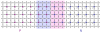
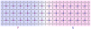

曾仔细研究 PN 结、三极管、MOS 管很多次，一直感觉有些东西没有领悟透彻，而这次研究比较透彻，总结一下。

### 未通电

常见的 PN 结是这样画的，左边是 P 型半导体，右边是 N 型半导体。

外部未通电时，交汇处的 N 型半导体的自由电子扩散到 P 的区域，所以 N 失去电子带正电（粉红色表示），P 收到电子带负电（浅蓝色表示）。

扩散到 P 区的电子基本不会向左继续扩散，因为受到粉红色区域正电荷的吸引，扩散力和吸引力最终达到一个平衡。

第一个迷思是，粉红色区域右侧的电子会不会被粉红色区域吸引，从而聚集到粉红色区域？

答案是不会，因为右侧区域有自由电子，整体是导电的，所以电势是相同的，准确画法应该是下面这样，更好理解：

### 正向导电

PN 正向导电时，外部电源正极接 P 型半导体，负极接 N 型半导体，会中和掉静态形成的 PN 结电势差（0.7V 左右），从而让电子继续向左扩散（原有的扩散力加上电源减掉0.7V的电场力）。

这里继续扩散有个细节要注意，并非从中间区域依次向左填满所有空穴，可以想像一下，如果一块单独的 P 型半导体，它的所有空穴都被电子填满，那么它相当于带了负的成千上万 V 的静电。
又或者想像一下，未通电时形成的 PN 结是很薄的一层，这一层里面 P 型半导体大多数空穴被电子填满，对应 0.7V 的负电压，如果比这个厚度再厚 1000 倍的区域的空穴被电子填满，那就相当于 700V 的电压。

所以，继续扩散时，P 型半导体总体多出的电子还是占很少的部分，空穴占了绝大多数。当这些少数电子慢慢扩散到最左侧的金属管脚，才形成了持续的电流（此时 P 型半导体依旧是空穴占了绝大多数）。

关于金属管脚，这里要提一下肖特基二极管，肖特基二极管是金属和 N 型半导体组成，用金属代替 P 型半导体，原理和 PN 结也差不多，这里不细说。这里要说的是，普通二极管、三极管、MOS 管和芯片的管脚都是半导体和金属连接，岂不是每个管脚还存在一个肖特基二极管？又或者说，肖特基二极管核心是金属和 N 型半导体，那 N 型半导体的管脚也是金属，那么不就是 金属--半导体--金属 这样的组合，那正反不就都一样？答案是，芯片领域金属和半导体连接时有个术语是欧姆接触和肖特基接触，普通的管脚使用的是欧姆接触，它用了一系列的工艺，消除了金属和半导体直接接触产生的肖特基二极管，具体也不细说。我们后面分析二极管、三极管、MOS 等器件时，不用考虑金属管脚的问题了。

### 反向截止

比较难理解的是 PN 结的反向截止，此时外部电源正极接 N 型半导体，负极接 P 型半导体。

外部电源会向 P 型半导体注入少量电子（数量和电源电压成正比），这些电子向右移动（扩散+电场吸引）然后把 PN 结外层 P 型半导体的空穴填满，从而加厚了 PN 结。
同理 N 型半导体的电子被外部电源抽走相同数量，也加厚了 PN 结。

但是，由于电池电场 + PN 结原有电场，电场很强了，为何不会把 PN 结 P 区域原本空穴中的电子吸到 N 区，从而形成电流？
未外部通电时，PN 结存在 0.7V 的电场力，就与电子扩散力达到了平衡，那么反向电压远超过 0.7V，按理应该让电子反向扩散。

我的理解是，开头有提及 PN 结的外侧都是导电的，PN 结中心区域是高阻态的，但也不是完全不导电，因为有反向漏电流。也就是说由较外侧到中间，电阻逐渐增大。
所以，外部电源的电压虽然比 0.7V 高很多，但是分散到内部比较近的距离，电压差其实是不大的。有点类似高压电线掉到地面，要双脚跳着离开的道理。
也就是说，外部供电最终分布到 PN 结最核心区域的电压并没有超过 0.7V，也就没能完全抗衡电子的扩散力、让电子向右移动。

而且，由于反向偏置使 PN 结加宽，高阻区域变宽，单位距离分到的电压差也就越低。

而超大的反向击穿电压，分布到 PN 结最核心区域的电场力超过了电子的扩散力，就可以让电子大量向右移动了。

### 三极管 / MOS 管

接下来说一说 三极管 和 MOS 管，只有真正理解了 PN 结的本质，才好理解 三极管 和 MOS 管。

三极管 和 MOS 管的核心其实都是：让反向偏置和截止的 PN 结也能导通。

让反向偏置截止的 PN 结导通的核心，我认为是：降低上述电子的扩散力场，以便在现有供电的情况下，让电子向右移动。

降低上述电子的扩散力场的方法是：降低 PN 结两侧的电子的潜在的浓度差。
譬如说让 PN 结的 P 区域的空穴填满电子的情况下还有多余活动电子存在，让 PN 结的 P 区有高浓度电子。

譬如对于 NPN 三极管，b 悬空时，仅 c e 加正电，PN(c) 默认是反向截止的。
当 b e 加正电时，PN(e) 导通，电子由 e 进去，从 b 离开。
由于 P 比较薄，电子从 b 离开前，非常靠近 PN(c) 结的边缘，从而增加了该 PN 结 P 区域电子浓度，从而使 PN(c) 也导电。

又譬如 MOS 管，gate 脚是一个电容，gate 脚和 P 之间加上电压，gate 为正，外部电源会向 P 型半导体注入少量电子（数量和电源电压成正比），
这些电子会被 gate 脚电场吸引聚集在 P 型半导体靠近 gate 的区域，而这一聚集增加了其中反向偏置的 PN 结的 P 区域的电子浓度，从而使该 PN 结导通。

### 更多设想

直接把 MOS 简化成这样可以吗？控制电压加在 gate 和 s 之间，使反向偏置的 d s 导通。

又或者这样简化三极管可以吗？让 a e 通过一个控制电流，同时 a 又靠近 PN 结，使反向偏置的 c e 导通。

我认为是可行的，只是这样的器件，应用上没有标准的 三极管 和 MOS 管灵活，所以不这样设计。
更有可能是非简化器件的制作工艺反而更简单。

其实，通常 MOS 衬底会接到 s 脚，也就相当于简化后的样子。

 
 This work is licensed under a <a rel="license" href="http://creativecommons.org/licenses/by/4.0/">Creative Commons Attribution 4.0 International License</a>.
