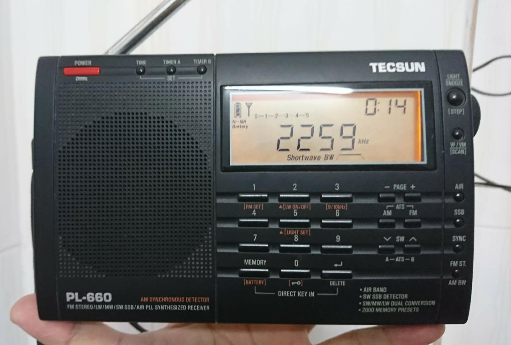
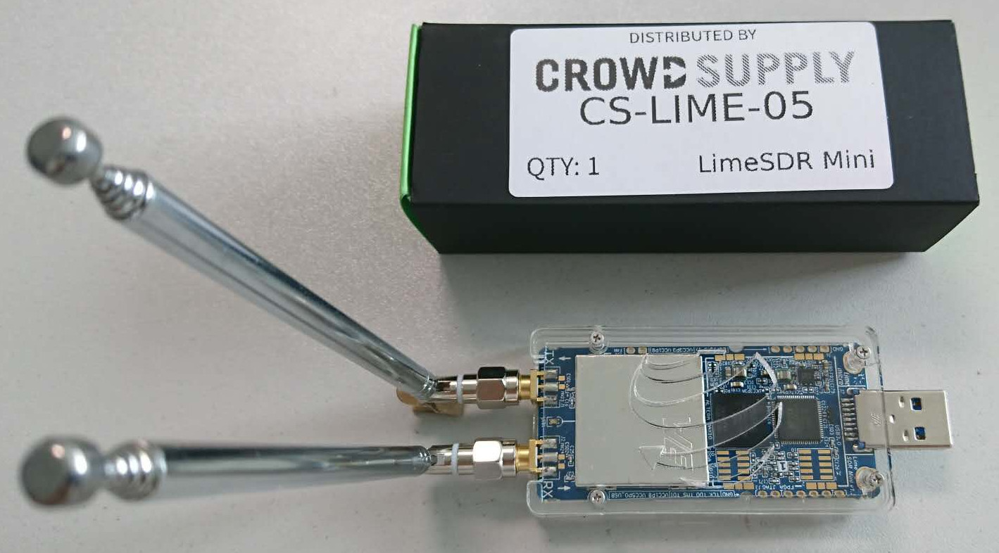
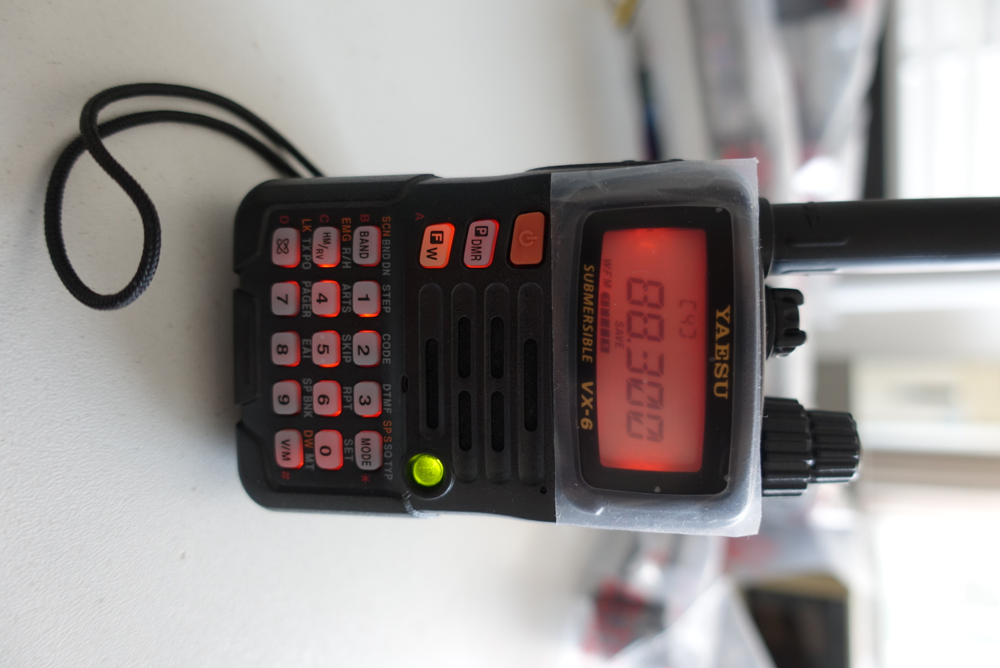
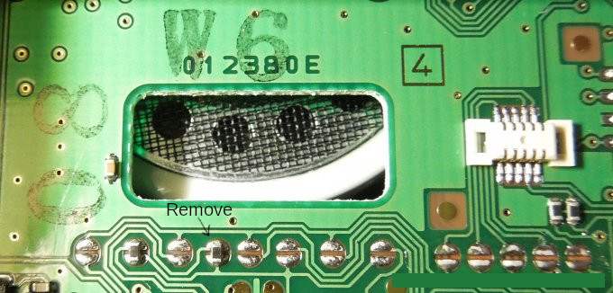

做爲一個老無線電愛好者，很早很早之前就打算買一個 SDR，然而我有技術潔癖，不想買自己不喜歡的方案，譬如 HackRF-One（其實是我懶，不想用不熟的 Xilinx FPGA 和 NXP CPU，剛畢業的時候用過 Xilinx 做過項目，後來就生疏了）。
最近工作上正好需要，又對比了半天，最終發現 LimeSDR-Mini 相對還不錯，於是便入手（如果頻率下限能比 10Mhz 再低一些，上限能由 3.5GHz 提高到 6GHz，然後再使用 Type-C 接口就完美了）。

玩無線電，還是多用 GNU Radio 仿真一下，更容易理解，硬件不是必需，但有一個玩起來更爽。

以下是我用來玩無線電的設備演化，最早是用收音機，然後是用 “天線寶寶”（同事取的名字，型號 KC901S，有矢網、頻譜、信號發送等功能），最後就是 LimeSDR-Mini 了：

 

添新成員 VX-6 手台（搭配了 SU-1 氣壓高度模組）：

Unlock VX-6  
已經解鎖，現在 40\~570 MHz 都可以發射了。小於 580 MHz 也可以發射，不過很快會自動保護，我只試了最低功率發射。  
原本發射是 50\~54 MHz, 140\~174 MHz, 420\~470 MHz; 接收是 0.5\~999 MHz.

解鎖方法是去掉箭頭指向的電阻（據說還要復位一下軟件：開機前按住鍵盤最右邊一排 3 個鍵不放，然後按提示再按 F/W 鍵確認）：

現在又添加了 FBA-23 干電池盒，可以直接安裝兩節 14500 鋰電池（默認串連），還準備在電池盒背部開孔安裝充電觸點。

