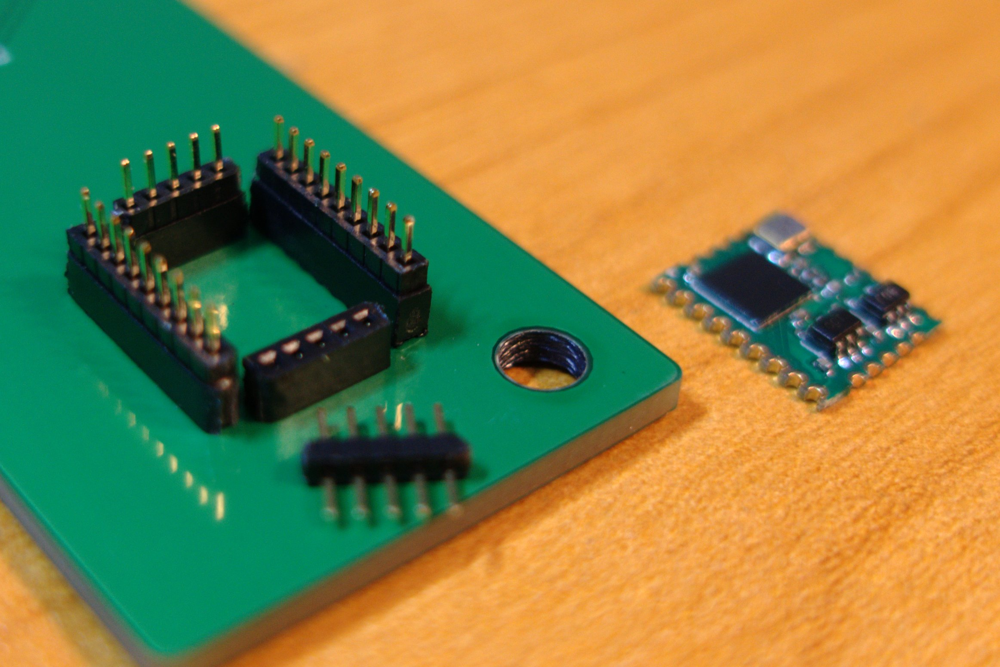
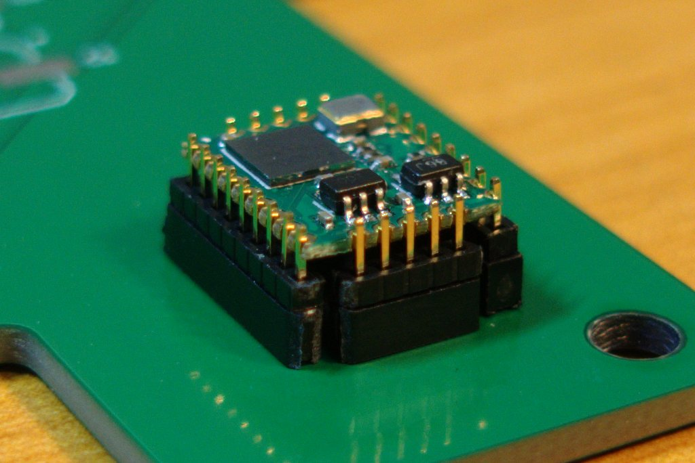
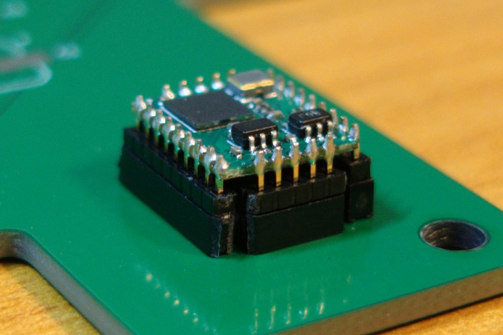
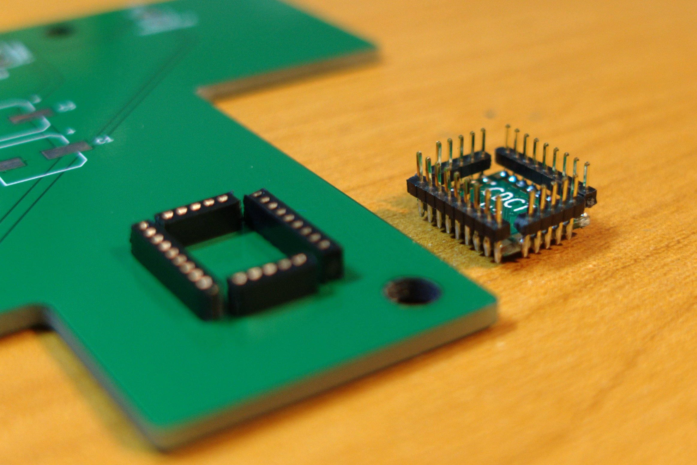

Last time, I wrote an article about how to connect half-holes pcb without soldering, I give it a name called CDBITE:

Link: https://github.com/dukelec/cdbus_doc/tree/master/cdbite

But CDBITE only suitable for two sides half-holes pcb, if we want to connect a pcb with more than two sides, we can use another method described below:

Video you might be interested in: "Special Soldering Tricks (by duke)"  
https://www.youtube.com/watch?v=uELCZHygcIg  
(Link for Mainland China: https://v.youku.com/v_show/id_XMzgwNjExODM4NA==.html)

 
 This work is licensed under a <a rel="license" href="http://creativecommons.org/licenses/by/4.0/">Creative Commons Attribution 4.0 International License</a>.
