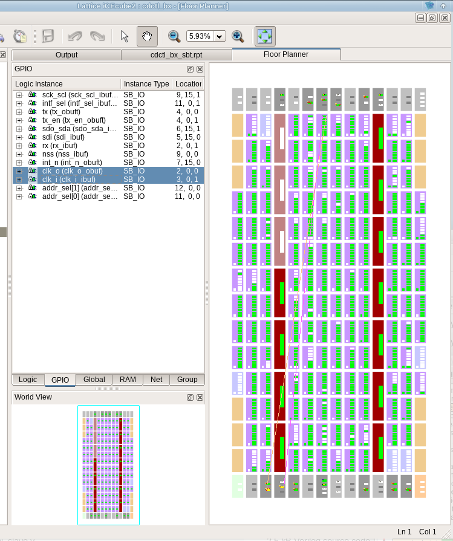

Sometimes for lower the cost, I'd like to use crystal instead of oscillator for FPGAs.

Outside circuit:


Full schematic could be found at: https://github.com/dukelec/cdpga/tree/master/cdpga_b/files

We need implement an inverter between `CLK_I` and `CLK_O`:

```
module example(
    input       clk_i,
    output      clk_o,
    
    ...
);

assign clk_o = ~clk_i;
// wire clk = clk_o;

...

endmodule
```

When implement an inverter from one input pin to an output pin, we actually have many stages cascaded,
so the crystal frequency can't be too high, e.g. 4, 8, 12, 16 MHz is fine, and we should add constraintion to reduce the delay.  
(For very low frequency crystal, e.g. 32.768 kHz, we should add constraintion to increase the delay, even add more stages by ourself.)

Before we add any constraint, the inverter placed far away from input and output pins, and the clk_o only get ~450kHz:  
(Sometimes the inverter placed in the middle, we can get 16 MHz clock, but some functions not stable at sometimes.)



After add this constraint, we can get 16 MHz clock, and all other functions in the FPGA are very stable:
```
#set_max_delay -from [get_ports {clk_i}] -to [get_ports {clk_o}] 10.00 # this one not work

# create virtual clock
create_clock -name vclk -period 10
set_clock_uncertainty -setup 0.3 [get_clocks {vclk}]
set_input_delay -max 0.4 -clock vclk [get_ports {clk_i}]
set_output_delay -max 0.4 -clock vclk [get_ports {clk_o}]
```


<br>
<a rel="license" href="http://creativecommons.org/licenses/by/4.0/"></a><br />This work is licensed under a <a rel="license" href="http://creativecommons.org/licenses/by/4.0/">Creative Commons Attribution 4.0 International License</a>.

