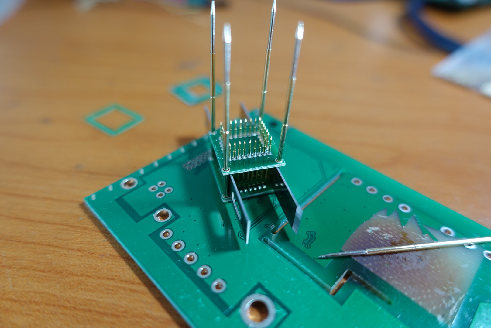
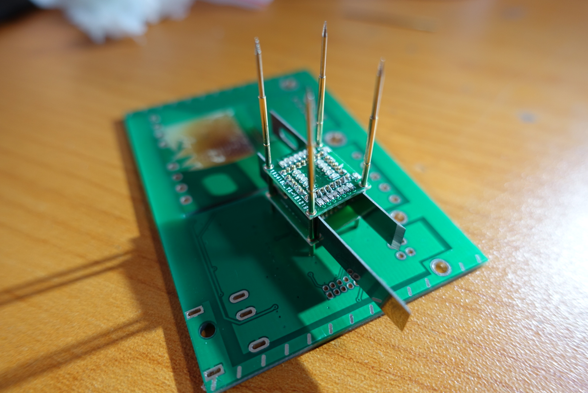

For test the tiny MAX10 FPGA module -- <a href="https://github.com/dukelec/cdpga/tree/master/cdpga_h">CDPGA-H</a>, I make a fixture, finished result:

First, use a blade back to saw the PCB to 4 pieces:

Insert the probe, apply solder paste to the joint, and solder with a heat gun:

Soldering the bottom in the same way:

Solder the wire, or use the probe sleeve with wire directly:

 
 This work is licensed under a <a rel="license" href="http://creativecommons.org/licenses/by/4.0/">Creative Commons Attribution 4.0 International License</a>.
